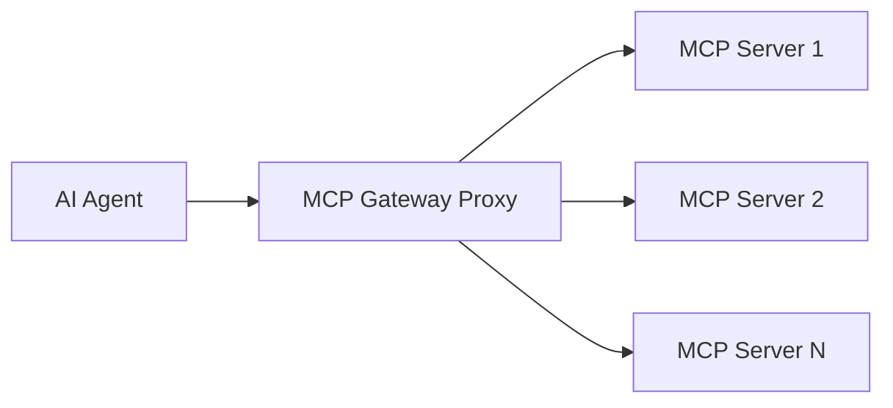
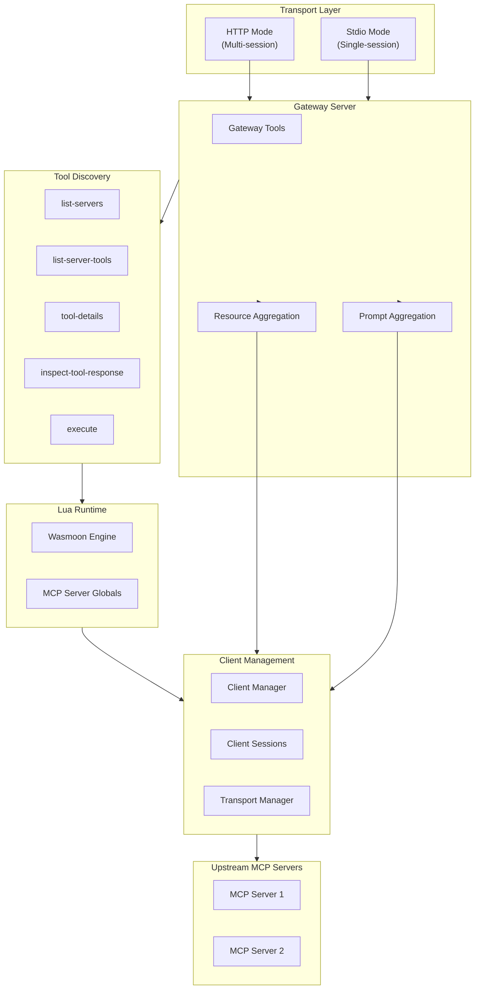
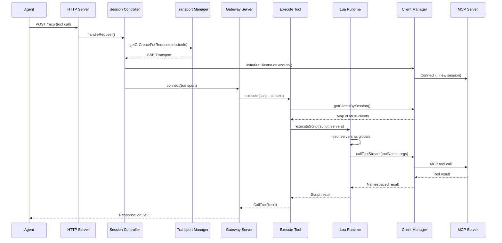

# MCP Gateway Proxy - Architecture Overview

This document provides a high-level overview of the MCP Gateway Proxy architecture, explaining how the system works end-to-end.

## What is This?

The MCP Gateway Proxy is a server that acts as a single point of entry to multiple MCP (Model Context Protocol) servers. Instead of connecting to each MCP server individually, AI agents connect to this gateway and gain access to all configured servers through:

- **Progressive tool discovery** - Agents learn about available tools incrementally
- **Lua-based orchestration** - Scripts can call tools across multiple servers in a single execution
- **Session isolation** - Each client session gets isolated state and connections



## Core Design Principles

### 1. Progressive Tool Discovery

Agents start with zero knowledge and build context incrementally:

1. `list-servers` - Discover what MCP servers are available
2. `list-server-tools` - See what tools a specific server provides
3. `tool-details` - Get full schema and examples for a tool
4. `execute` - Call discovered tools via Lua scripts

This keeps context minimal until tools are actually needed. See [Progressive Discovery](./progressive-discovery.md) for details.

### 2. Session Isolation

In HTTP mode, each client session gets:

- Isolated MCP client connections to upstream servers
- Separate caches for resources, prompts, and tool lists
- Session IDs propagated to upstream servers for request correlation

See [Session Management](./session-management.md) for details.

### 3. Lua Orchestration

Tools are called through Lua scripts, enabling:

- Multi-server tool calls in a single request
- Result processing and transformation
- Secure sandboxed execution

See [Lua Runtime](./lua-runtime.md) for details.

## Component Architecture



## Request Flow (HTTP Mode)

This sequence diagram shows the complete flow when an agent executes a Lua script:



## Key Components

| Component          | File                                        | Purpose                                   |
| ------------------ | ------------------------------------------- | ----------------------------------------- |
| Entry Point        | `src/index.ts`                              | Starts HTTP or stdio mode based on config |
| DI Container       | `src/container/inversify.config.ts`         | Wires all dependencies together           |
| Gateway Server     | `src/mcp/gateway-server.ts`                 | Main MCP server, registers tools          |
| Client Manager     | `src/mcp/client-manager.ts`                 | Manages upstream MCP connections          |
| Transport Manager  | `src/mcp/transport-manager.ts`              | Caches HTTP transports per session        |
| Session Controller | `src/controllers/mcp-session-controller.ts` | Routes HTTP requests                      |
| Lua Runtime        | `src/lua/runtime.ts`                        | Executes user scripts                     |
| Tool Discovery     | `src/mcp/tool-discovery-service.ts`         | Powers discovery tools                    |

## Transport Modes

The gateway supports two transport modes:

| Aspect      | HTTP Mode                 | Stdio Mode              |
| ----------- | ------------------------- | ----------------------- |
| Sessions    | Multiple concurrent       | Single                  |
| Client Init | Lazy (on first request)   | Eager (at startup)      |
| Use Case    | Web APIs, multiple agents | CLI tools, single agent |

See [Transport Modes](./transport-modes.md) for details.

## Configuration

The gateway is configured via `config.json`:

```json
{
  "port": 8080,
  "host": "localhost",
  "transport": "http",
  "mcpClients": {
    "server-name": {
      "type": "http",
      "url": "http://localhost:3000/mcp"
    }
  }
}
```

See `CONFIG.md` in the project root for the full configuration reference.

## Detailed Documentation

- [Transport Modes](./transport-modes.md) - HTTP vs stdio transport
- [Progressive Discovery](./progressive-discovery.md) - Tool discovery workflow
- [Lua Runtime](./lua-runtime.md) - Script execution system
- [Session Management](./session-management.md) - Session isolation and client management
- [Resource Namespacing](./resource-namespacing.md) - Resource and prompt aggregation
