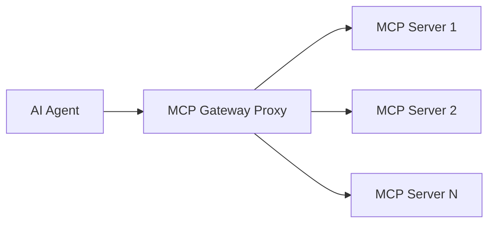
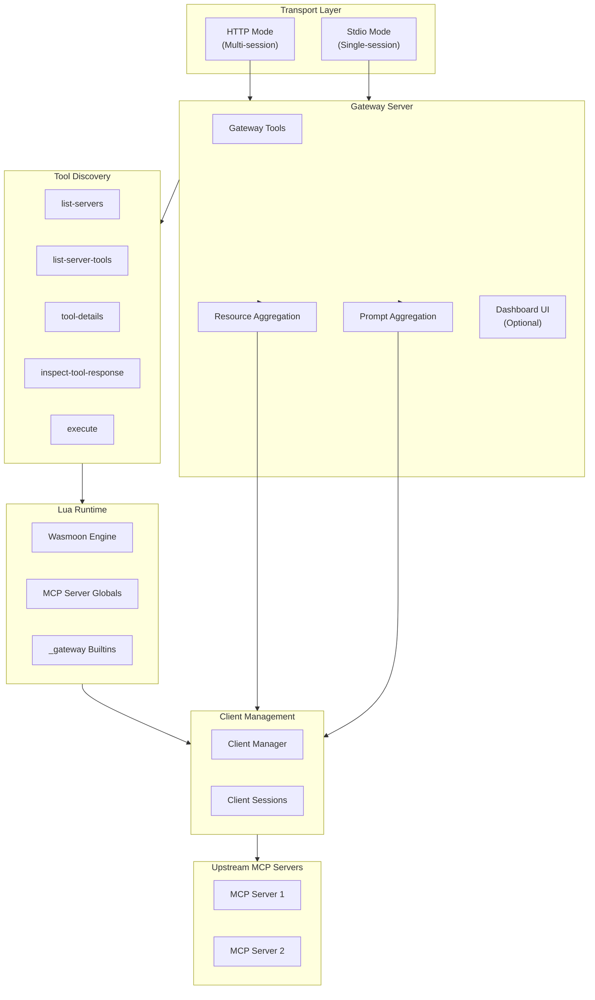
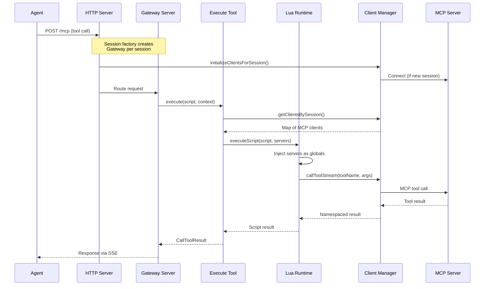

# MCP Gateway Proxy - Architecture Overview

This document provides a high-level overview of the MCP Gateway Proxy architecture, explaining how the system works end-to-end.

## What is This?

The MCP Gateway Proxy is a server that acts as a single point of entry to multiple MCP (Model Context Protocol) servers. Instead of connecting to each MCP server individually, AI agents connect to this gateway and gain access to all configured servers through:

- **Progressive tool discovery** - Agents learn about available tools incrementally
- **Lua-based orchestration** - Scripts can call tools across multiple servers in a single execution
- **Session isolation** - Each client session gets isolated state and connections


```mermaid
flowchart LR
    Agent[AI Agent] --> Gateway[MCP Gateway Proxy]
    Gateway --> Server1[MCP Server 1]
    Gateway --> Server2[MCP Server 2]
    Gateway --> Server3[MCP Server N]
```

## Core Design Principles

### 1. Progressive Tool Discovery

Agents start with zero knowledge and build context incrementally:

1. `list-servers` - Discover what MCP servers are available
2. `list-server-tools` - See what tools a specific server provides
3. `tool-details` - Get full schema and examples for a tool
4. `execute` - Call discovered tools via Lua scripts

This keeps context minimal until tools are actually needed. See [Progressive Discovery](./progressive-discovery.md) for details.

### 2. Session Isolation

In HTTP mode, each client session gets:

- Isolated MCP client connections to upstream servers
- Separate caches for resources, prompts, and tool lists
- Session-scoped state (upstream session IDs are independent)

See [Session Management](./session-management.md) for details.

### 3. Lua Orchestration

Tools are called through Lua scripts, enabling:

- Multi-server tool calls in a single request
- Result processing and transformation
- Secure sandboxed execution

See [Lua Runtime](./lua-runtime.md) for details.

## Component Architecture


```mermaid
flowchart TB
    subgraph Transport["Transport Layer"]
        HTTP["HTTP Mode<br/>(Multi-session)"]
        Stdio["Stdio Mode<br/>(Single-session)"]
    end

    subgraph Gateway["Gateway Server"]
        Tools["Gateway Tools"]
        ResourceAgg["Resource Aggregation"]
        PromptAgg["Prompt Aggregation"]
        Dashboard["Dashboard UI<br/>(Optional)"]
    end

    subgraph Discovery["Tool Discovery"]
        ListServers["list-servers"]
        ListTools["list-server-tools"]
        ToolDetails["tool-details"]
        Inspect["inspect-tool-response"]
        Execute["execute"]
    end

    subgraph Runtime["Lua Runtime"]
        Wasmoon["Wasmoon Engine"]
        ServerGlobals["MCP Server Globals"]
        GatewayBuiltins["_gateway Builtins"]
    end

    subgraph Clients["Client Management"]
        ClientManager["Client Manager"]
        ClientSession["Client Sessions"]
    end

    subgraph Upstream["Upstream MCP Servers"]
        MCP1["MCP Server 1"]
        MCP2["MCP Server 2"]
    end

    HTTP --> Gateway
    Stdio --> Gateway
    Gateway --> Discovery
    Discovery --> Runtime
    Runtime --> Clients
    Clients --> Upstream
    Gateway --> ResourceAgg
    Gateway --> PromptAgg
    ResourceAgg --> Clients
    PromptAgg --> Clients
```

## Request Flow (HTTP Mode)

This sequence diagram shows the complete flow when an agent executes a Lua script:


```mermaid
sequenceDiagram
    participant Agent
    participant HTTP as HTTP Server
    participant Gateway as Gateway Server
    participant Execute as Execute Tool
    participant Lua as Lua Runtime
    participant Client as Client Manager
    participant Upstream as MCP Server

    Agent->>HTTP: POST /mcp (tool call)
    Note over HTTP,Gateway: Session factory creates<br/>Gateway per session
    HTTP->>Client: initializeClientsForSession()
    Client->>Upstream: Connect (if new session)
    HTTP->>Gateway: Route request
    Gateway->>Execute: execute(script, context)
    Execute->>Client: getClientsBySession()
    Client-->>Execute: Map of MCP clients
    Execute->>Lua: executeScript(script, servers)
    Lua->>Lua: Inject servers as globals
    Lua->>Client: callToolStream(toolName, args)
    Client->>Upstream: MCP tool call
    Upstream-->>Client: Tool result
    Client-->>Lua: Namespaced result
    Lua-->>Execute: Script result
    Execute-->>Gateway: CallToolResult
    Gateway-->>Agent: Response via SSE
```

## Key Components

| Component      | File                                                     | Purpose                                  |
| -------------- | -------------------------------------------------------- | ---------------------------------------- |
| Entry Point    | `apps/gateway/src/index.ts`                              | Delegates to startup                     |
| Startup        | `apps/gateway/src/startup.ts`                            | Initializes DI, clients, and servers     |
| DI Container   | `apps/gateway/src/container/inversify.config.ts`         | Wires all dependencies together          |
| Gateway Server | `apps/gateway/src/mcp/gateway-server.ts`                 | Main MCP server, registers tools         |
| Client Manager | `packages/mcp-client/src/client-manager.ts`              | Manages upstream MCP connections         |
| Lua Runtime    | `packages/lua-runtime/src/runtime.ts`                    | Executes user scripts                    |
| Tool Discovery | `packages/mcp-aggregation/src/tool-discovery-service.ts` | Powers discovery tools                   |
| Dashboard      | `apps/gateway/src/dashboard/dashboard-server.ts`         | Optional web UI for execution monitoring |

## Transport Modes

The gateway supports two transport modes:

| Aspect      | HTTP Mode                 | Stdio Mode              |
| ----------- | ------------------------- | ----------------------- |
| Sessions    | Multiple concurrent       | Single                  |
| Client Init | Lazy (on first request)   | Deferred (on downstream init) |
| Use Case    | Web APIs, multiple agents | CLI tools, single agent |

See [Transport Modes](./transport-modes.md) for details.

## Configuration

The gateway is configured via `config.json`:

```json
{
  "port": 8080,
  "host": "localhost",
  "transport": "http",
  "mcpClients": {
    "server-name": {
      "type": "http",
      "url": "http://localhost:3000/mcp"
    }
  }
}
```

See the [Configuration Guide](../configuration.md) for the full configuration reference.

## Detailed Documentation

- [Transport Modes](./transport-modes.md) - HTTP vs stdio transport
- [Progressive Discovery](./progressive-discovery.md) - Tool discovery workflow
- [Lua Runtime](./lua-runtime.md) - Script execution system
- [Session Management](./session-management.md) - Session isolation and client management
- [Resource Namespacing](./resource-namespacing.md) - Resource and prompt aggregation
- [Sampling](./sampling.md) - Sampling support, security model, and ACP shim
- [Skills](./skills.md) - Reusable process documents for agents
- [Logging](../logging.md) - Logging configuration and output
