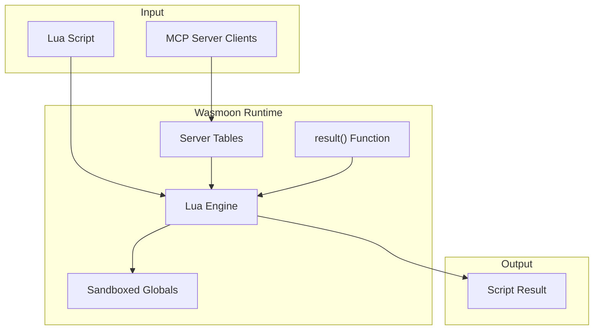
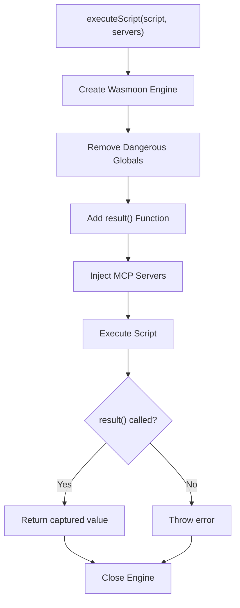
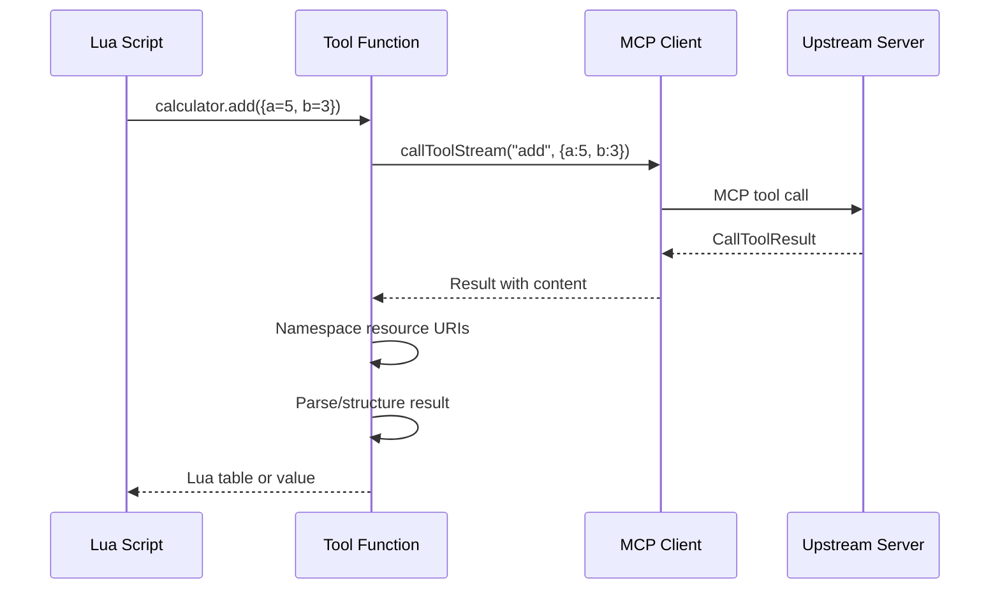
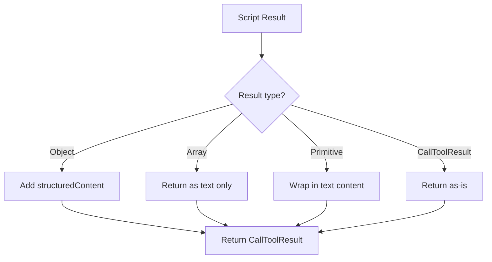

# Lua Runtime

The Lua runtime provides a sandboxed scripting environment where agents can orchestrate tool calls across multiple MCP servers. This document explains how it works.

## Overview

The runtime uses [Wasmoon](https://github.com/ceifa/wasmoon), a Lua VM compiled to WebAssembly, to execute user scripts safely in isolation.



## Script Execution Flow



### Step-by-Step

1. **Create Engine** - New Wasmoon `LuaEngine` instance
2. **Sandbox** - Remove dangerous globals (`os`, `io`, `require`, etc.)
3. **Add result()** - Register callback to capture return value
4. **Inject Servers** - Create Lua tables for each MCP server
5. **Execute** - Run the user's script
6. **Capture Result** - Return whatever was passed to `result()`
7. **Cleanup** - Close the engine

## Security Sandboxing

The runtime removes access to dangerous Lua APIs:

| Removed Global | Why                                 |
| -------------- | ----------------------------------- |
| `os`           | System commands, environment access |
| `io`           | File system operations              |
| `require`      | Module loading                      |
| `dofile`       | Execute external files              |
| `loadfile`     | Load external files                 |
| `package`      | Package/module system               |
| `debug`        | Debug introspection                 |

Scripts can only:

- Use basic Lua operations (math, strings, tables)
- Call MCP server tools through injected globals
- Return results via the `result()` function

## MCP Server Injection

Each configured MCP server becomes a Lua global table with functions for each tool.

### Name Sanitization

Server and tool names are sanitized to valid Lua identifiers:

```
data-server  →  data_server
my.api       →  my_api
123service   →  _123service
while        →  _while (reserved keyword)
```

Implementation: `src/utils/lua-identifier.ts`

### Server Table Structure

For a server named `calculator` with tools `add` and `multiply`:

```lua
-- Injected as global
calculator = {
    add = function(args) ... end,
    multiply = function(args) ... end
}
```

### Tool Function Implementation

Each tool function:

1. Accepts a Lua table of arguments
2. Calls the real MCP tool via `callToolStream()`
3. Namespaces any resource URIs in the result
4. Returns structured content or parsed JSON



## The Promise/Await Pattern

Lua doesn't have native async/await. Wasmoon provides this through JavaScript interop:

```lua
-- Tool calls return promise-like objects
local promise = calculator.add({ a = 5, b = 3 })

-- :await() unwraps the promise synchronously
local result = promise:await()

-- Shorthand: chain immediately
local result = calculator.add({ a = 5, b = 3 }):await()
```

### How It Works

1. Tool functions are JavaScript async functions
2. Wasmoon exposes them as callable Lua objects
3. The `:await()` method blocks until the promise resolves
4. The resolved value is converted to Lua types

### Sequential Execution

Multiple `:await()` calls execute sequentially:

```lua
-- These run one after another, not in parallel
local a = server.tool1({ x = 1 }):await()
local b = server.tool2({ y = 2 }):await()
local c = server.tool3({ z = 3 }):await()
result({ a = a, b = b, c = c })
```

## The result() Function

Scripts must call `result()` exactly once to return data:

```lua
-- Return a simple value
result(42)

-- Return a table (becomes structured content)
result({ sum = 10, product = 20 })

-- Return tool output directly
local data = server.fetch_data({}):await()
result(data)
```

### Common Mistake

Shadowing `result` with a local variable:

```lua
-- WRONG: shadows the global result() function
local result = calculator.add({ a = 1, b = 2 }):await()
result(result)  -- Error: attempt to call a table value
```

The runtime detects this and provides a helpful error message.

### Correct Pattern

```lua
-- Use a different variable name
local sum = calculator.add({ a = 1, b = 2 }):await()
result(sum)
```

## Result Processing

The `execute` tool processes script results:



### structuredContent

When the result is an object (not an array), it's included as `structuredContent`:

```typescript
{
  content: [{ type: "text", text: '{"sum":10,"product":20}' }],
  structuredContent: { sum: 10, product: 20 }
}
```

This allows LLMs to parse the structured data more reliably.

Arrays are excluded from `structuredContent` because the MCP spec only allows objects.

## Resource URI Namespacing

When tools return resources, URIs are namespaced with the server name:

```
Original:    file:///data.json
Namespaced:  mcp://calculator/file:///data.json
```

This happens in the runtime during tool execution because:

- The runtime knows which server each tool came from
- Scripts can call tools from multiple servers
- Namespacing must happen per-call, not per-response

See [Resource Namespacing](./resource-namespacing.md) for details.

## Example Scripts

### Simple Tool Call

```lua
local result = calculator.add({ a = 10, b = 20 }):await()
result(result)
```

### Multi-Server Orchestration

```lua
-- Fetch data from one server
local data = data_server.fetch_records({ limit = 10 }):await()

-- Process with another server
local summary = analytics.summarize({ records = data.records }):await()

-- Return combined result
result({
    record_count = #data.records,
    summary = summary
})
```

### Error Handling

```lua
local success, data = pcall(function()
    return risky_server.dangerous_operation({}):await()
end)

if success then
    result({ status = "ok", data = data })
else
    result({ status = "error", message = tostring(data) })
end
```

### Data Transformation

```lua
local raw = data_server.get_users({}):await()

-- Transform in Lua
local names = {}
for i, user in ipairs(raw.users) do
    names[i] = user.name
end

result({ user_names = names })
```

## Implementation Files

| File                            | Purpose                           |
| ------------------------------- | --------------------------------- |
| `src/lua/runtime.ts`            | Main `WasmoonRuntime` class       |
| `src/tools/execute-lua-tool.ts` | Gateway tool that invokes runtime |
| `src/utils/lua-identifier.ts`   | Name sanitization utilities       |
| `src/utils/resource-uri.ts`     | URI namespacing for tool results  |

## Related Documentation

- [Progressive Discovery](./progressive-discovery.md) - How agents discover tools before executing
- [Resource Namespacing](./resource-namespacing.md) - How resource URIs are namespaced
- [Index](./index.md) - High-level architecture overview
