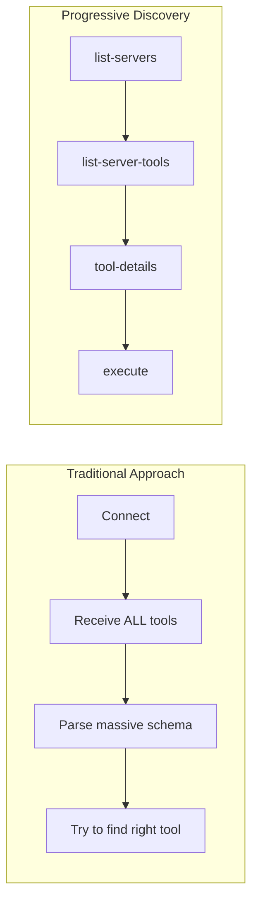
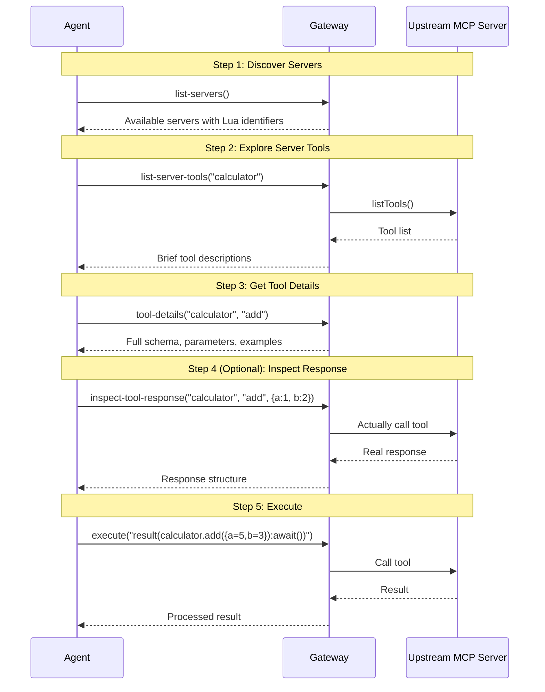
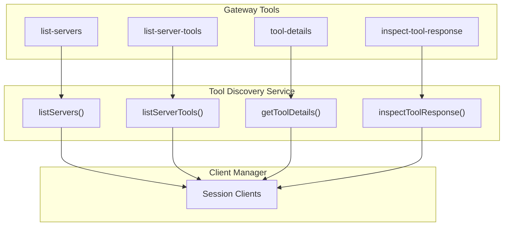

# Progressive Tool Discovery

Progressive tool discovery is the core innovation of the MCP Gateway Proxy. Instead of overwhelming agents with all available tools upfront, agents discover tools incrementally as needed.

## Why Progressive Discovery?

Traditional MCP servers expose all tools at once. With a gateway proxying multiple servers, this becomes problematic:

- **Context explosion** - Hundreds of tools flood the agent's context
- **Decision paralysis** - Hard for agents to choose the right tool
- **Wasted tokens** - Most tool schemas are never used

Progressive discovery solves this by letting agents build knowledge incrementally:



## The Discovery Workflow

Agents interact with the gateway through 5 tools:



## Gateway Tools

### 1. `list-servers`

Discovers what MCP servers are available in the current session.

**Input:** None

**Output:** Formatted list of servers with:
- Server name (original)
- Lua identifier (sanitized for use in scripts)
- Description, version, and instructions (if provided)

**Example Output:**
```
Available MCP Servers:

## calculator (Lua: calculator)
A simple calculator server
Version: 1.0.0

## data-server (Lua: data_server)
Provides data access tools
```

**Implementation:** `src/tools/list-servers-tool.ts`

### 2. `list-server-tools`

Lists tools available on a specific server.

**Input:**
- `luaServerName` - The Lua identifier from `list-servers`

**Output:** Brief descriptions of each tool with Lua identifiers

**Example Output:**
```
Tools for calculator:

- add (Lua: add): Add two numbers
- multiply (Lua: multiply): Multiply two numbers
- divide (Lua: divide): Divide two numbers
```

**Implementation:** `src/tools/list-server-tools-tool.ts`

### 3. `tool-details`

Gets comprehensive information about a specific tool.

**Input:**
- `luaServerName` - Server's Lua identifier
- `luaToolName` - Tool's Lua identifier

**Output:**
- Full description
- Complete input schema with types and descriptions
- Example usage in Lua

**Example Output:**
```
## add

Add two numbers together

### Parameters

- a (number, required): First number to add
- b (number, required): Second number to add

### Example Usage

local result = calculator.add({
  a = ...,
  b = ...
}):await()
```

**Implementation:** `src/tools/tool-details-tool.ts`

### 4. `inspect-tool-response`

Makes a sample call to see the actual response structure.

**Input:**
- `luaServerName` - Server's Lua identifier
- `luaToolName` - Tool's Lua identifier
- `sampleArgs` (optional) - Arguments for the sample call

**Output:** The actual response from calling the tool

**Warning:** This tool **actually executes** the target tool. Only use with:
- Read-only/idempotent operations
- Tools with minimal cost
- When you need to understand response structure

**Implementation:** `src/tools/inspect-tool-response-tool.ts`

### 5. `execute`

Executes a Lua script with access to all MCP servers.

**Input:**
- `script` - Lua code to execute

**Output:** `CallToolResult` with:
- Text content (always present)
- Structured content (if result is an object)

**Example:**
```lua
local sum = calculator.add({ a = 10, b = 20 }):await()
local product = calculator.multiply({ a = sum.result, b = 2 }):await()
result({ sum = sum, product = product })
```

**Implementation:** `src/tools/execute-lua-tool.ts`

See [Lua Runtime](./lua-runtime.md) for detailed script execution documentation.

## Tool Discovery Service

The `ToolDiscoveryService` (`src/mcp/tool-discovery-service.ts`) powers the discovery tools:



### Key Methods

| Method | Purpose |
|--------|---------|
| `listServers()` | Gathers info from all clients for a session |
| `listServerTools()` | Lists and sanitizes tool names for a server |
| `getToolDetails()` | Formats full schema with Lua examples |
| `inspectToolResponse()` | Generates and executes sample Lua script |

## Name Sanitization

Server and tool names are sanitized to valid Lua identifiers:

| Original | Lua Identifier |
|----------|---------------|
| `data-server` | `data_server` |
| `my.api` | `my_api` |
| `123numbers` | `_123numbers` |
| `while` | `_while` |

The `sanitizeLuaIdentifier()` function in `src/utils/lua-identifier.ts` handles:
- Replacing hyphens and dots with underscores
- Prefixing names starting with digits
- Escaping Lua reserved keywords

## Example Discovery Session

Here's how an agent might discover and use a calculator:

```
Agent: What servers are available?
→ Calls: list-servers()
← Returns: calculator, data-server

Agent: What can the calculator do?
→ Calls: list-server-tools("calculator")
← Returns: add, multiply, divide, sqrt

Agent: How do I use the add function?
→ Calls: tool-details("calculator", "add")
← Returns: Full schema with a, b parameters

Agent: Let me try adding numbers
→ Calls: execute("result(calculator.add({a=5,b=3}):await())")
← Returns: { result: 8 }
```

## Optimization Tips for Agents

1. **Batch discovery** - Call `list-server-tools` for servers you'll likely use
2. **Cache schemas** - Tool details don't change during a session
3. **Use inspect sparingly** - Only when response structure is unclear
4. **Combine operations** - Use Lua scripts to call multiple tools efficiently

## Related Documentation

- [Lua Runtime](./lua-runtime.md) - How scripts are executed
- [Session Management](./session-management.md) - How sessions provide isolated tool access
- [Index](./index.md) - High-level architecture overview
