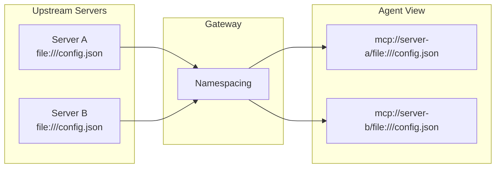
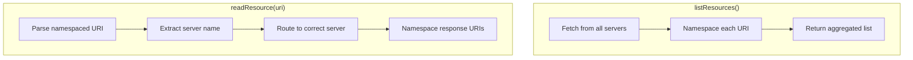
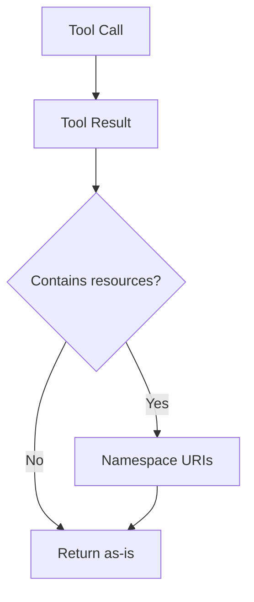
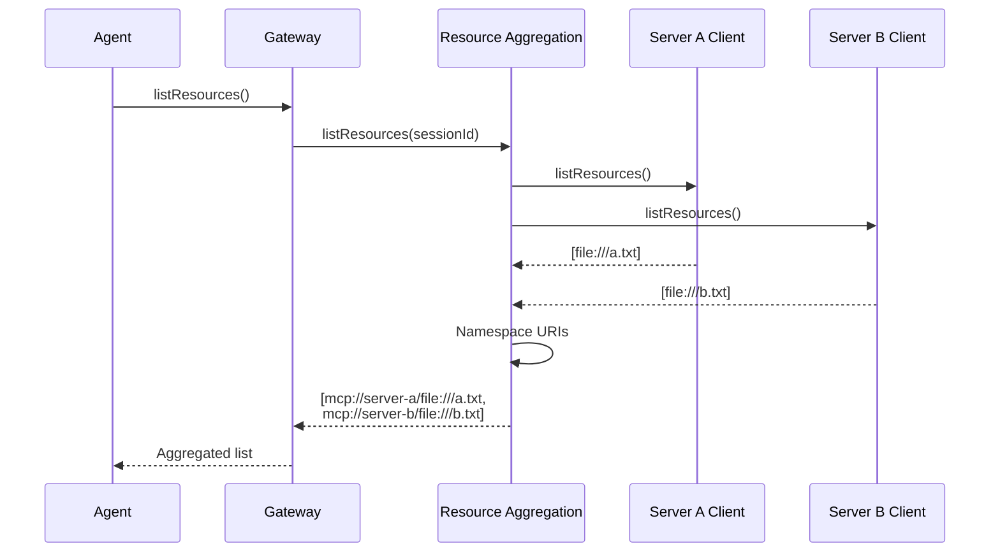
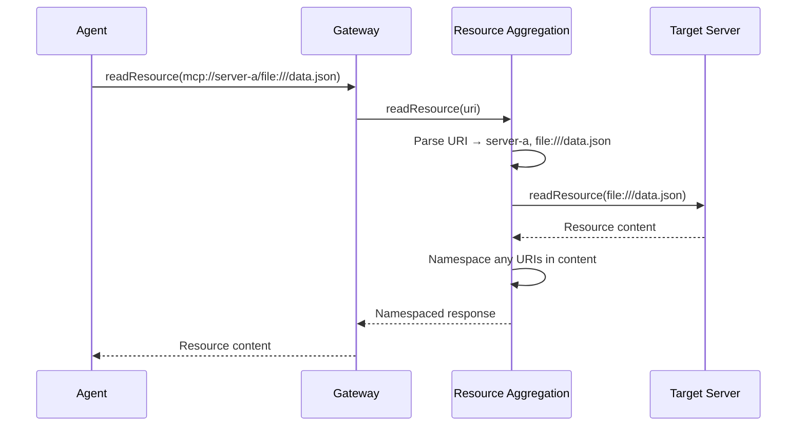
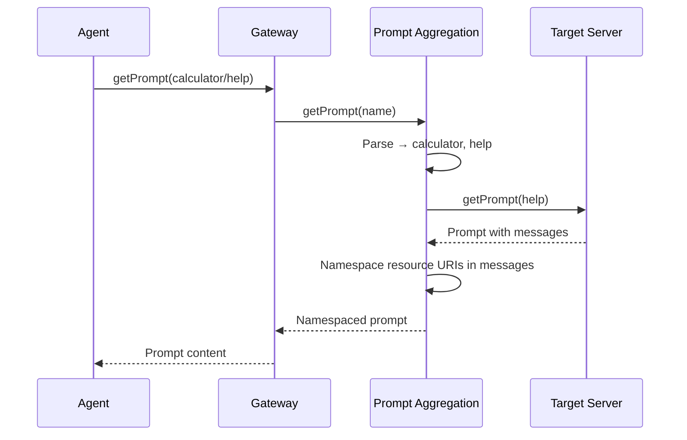

# Resource Namespacing

This document explains how the MCP Gateway Proxy aggregates resources and prompts from multiple upstream servers and uses URI namespacing to prevent collisions.

## The Problem

When proxying multiple MCP servers, resources and prompts can have conflicting identifiers:

```
Server A: file:///config.json
Server B: file:///config.json  ← Same URI, different content!
```

Without namespacing, the gateway couldn't distinguish which server owns which resource.

## The Solution: URI Namespacing

All resource URIs are prefixed with the server name:

```
Original:    file:///config.json
Namespaced:  mcp://server-a/file:///config.json
```

The `mcp://` scheme with server name creates a unique namespace.



## Where Namespacing Happens

Namespacing occurs at two levels:

### 1. Aggregation Services (Gateway Level)

For listing and reading resources/prompts:



### 2. Lua Runtime (Tool Results)

For tool call results that contain resources:



The runtime namespaces because:

- It knows which server the tool belongs to
- Scripts can call tools from multiple servers
- Results must be namespaced per-call

## URI Format

### Namespaced URI Structure

```
mcp://server-name/original-uri
└──┬─┘ └────┬────┘ └────┬────┘
scheme  server     original
```

### Examples

| Original                      | Server      | Namespaced                                 |
| ----------------------------- | ----------- | ------------------------------------------ |
| `file:///data.json`           | calculator  | `mcp://calculator/file:///data.json`       |
| `https://api.example.com/doc` | my-api      | `mcp://my-api/https://api.example.com/doc` |
| `custom://resource/1`         | data-server | `mcp://data-server/custom://resource/1`    |

## Resource Aggregation Service

The `ResourceAggregationService` handles resource operations:

### Listing Resources



### Reading Resources



### Caching

Resources are cached per session:

- First `listResources()` call fetches from all servers
- Subsequent calls return cached data
- Cache invalidated on `resources/list_changed` notification

## Prompt Aggregation Service

Prompts use a simpler namespacing scheme:

```
Format: {server-name}/{prompt-name}

Example: calculator/help
         data-server/query-builder
```

### Listing Prompts

Similar flow to resources:

1. Fetch from all servers
2. Prefix each prompt name with server name
3. Return aggregated list

### Getting Prompts



### Resource URIs in Prompts

Prompts can contain embedded resources or resource links. These are also namespaced:

```json
{
  "messages": [
    {
      "role": "user",
      "content": {
        "type": "resource",
        "resource": {
          "uri": "mcp://calculator/file:///template.txt"
        }
      }
    }
  ]
}
```

## Tool Result Namespacing

When tools return resources, the Lua runtime namespaces them:

### Content Types Namespaced

| Content Type    | Field Namespaced |
| --------------- | ---------------- |
| `resource`      | `resource.uri`   |
| `resource_link` | `uri`            |

### Example

Tool returns:

```json
{
  "content": [
    {
      "type": "resource_link",
      "uri": "file:///output.json"
    }
  ]
}
```

After namespacing (from `data-server`):

```json
{
  "content": [
    {
      "type": "resource_link",
      "uri": "mcp://data-server/file:///output.json"
    }
  ]
}
```

## URI Utilities

The `src/utils/resource-uri.ts` module provides:

### namespaceResourceUri

```typescript
namespaceResourceUri("data-server", "file:///data.json");
// → "mcp://data-server/file:///data.json"
```

### parseResourceUri

```typescript
parseResourceUri("mcp://data-server/file:///data.json");
// → { serverName: "data-server", originalUri: "file:///data.json" }
```

### namespaceResource

Namespaces a full resource object:

```typescript
namespaceResource("server", { uri: "file:///x", name: "X" });
// → { uri: "mcp://server/file:///x", name: "X" }
```

### namespaceCallToolResultResources

Walks through tool result content and namespaces all resource URIs.

### namespaceGetPromptResultResources

Namespaces resource URIs in prompt messages.

## Error Handling

### Invalid Namespaced URI

If an agent requests a resource with an invalid namespaced URI:

```
Requested: mcp://unknown-server/file:///data.json
Error: Server 'unknown-server' not found
```

### Missing Original URI

If the namespaced URI is malformed:

```
Requested: mcp://server
Error: Invalid namespaced URI format
```

## Implementation Files

| File                                      | Purpose                           |
| ----------------------------------------- | --------------------------------- |
| `src/utils/resource-uri.ts`               | URI namespacing/parsing utilities |
| `src/mcp/resource-aggregation-service.ts` | Resource listing and reading      |
| `src/mcp/prompt-aggregation-service.ts`   | Prompt listing and getting        |
| `src/lua/runtime.ts`                      | Tool result namespacing           |

## Design Decisions

### Why mcp:// Scheme?

- Clear indication this is a gateway-namespaced URI
- Won't conflict with other schemes (file, http, etc.)
- Easy to identify and parse

### Why Namespace in Runtime Too?

The aggregation services handle list/read operations, but tool results also need namespacing because:

- Tools can return resource links
- The runtime knows the source server
- Scripts can call multiple servers in one execution

### Why Not Modify Original URIs?

We preserve the original URI after the server name so:

- Upstream servers receive the exact URIs they expect
- Easy round-trip: namespace → parse → original
- No information loss

## Related Documentation

- [Lua Runtime](./lua-runtime.md) - Where tool result namespacing happens
- [Session Management](./session-management.md) - Per-session resource caching
- [Index](./index.md) - High-level architecture overview
