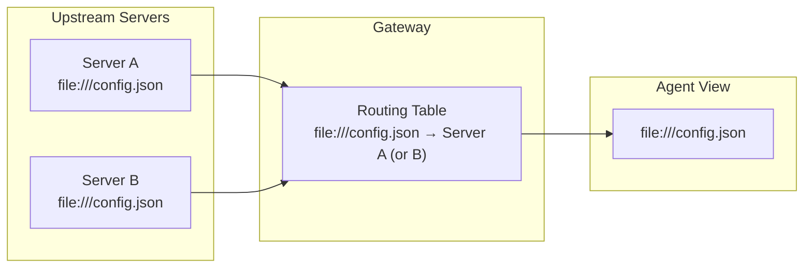
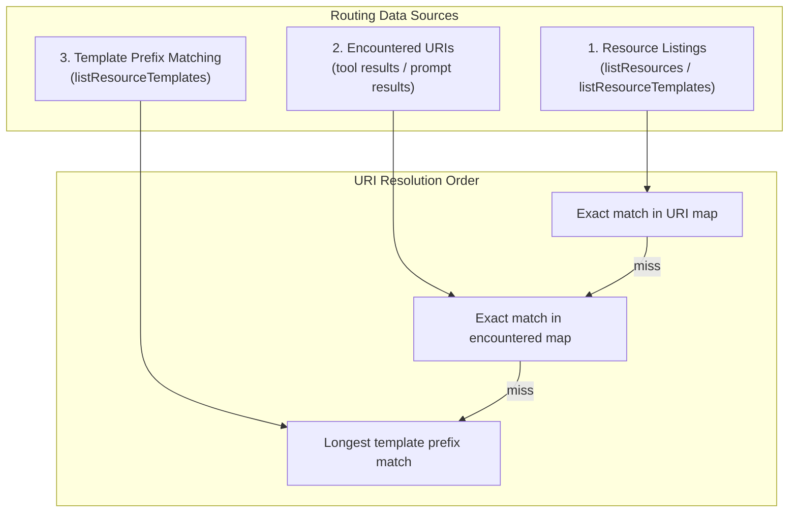
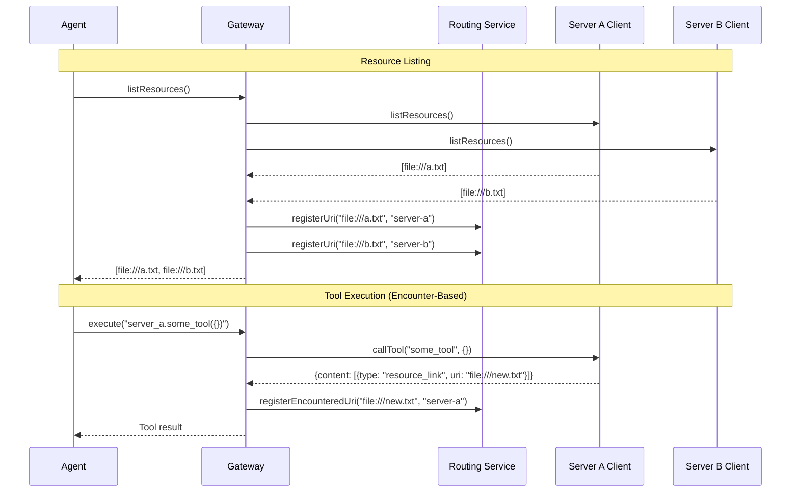
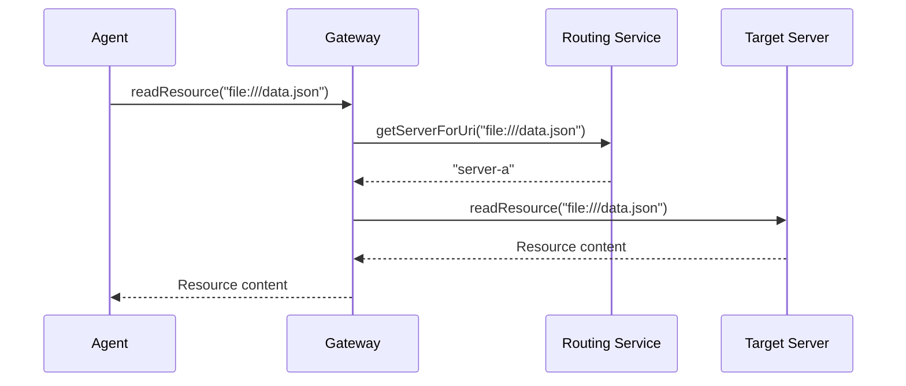
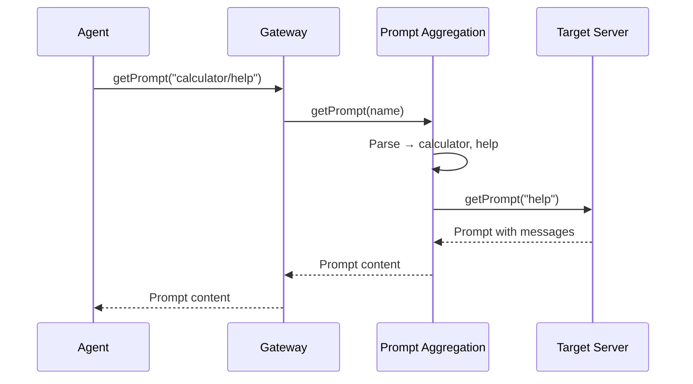

# Resource Routing

This document explains how the MCP Gateway Proxy aggregates resources and prompts from multiple upstream servers and routes requests to the correct server.

## The Problem

When proxying multiple MCP servers, resources and prompts can have conflicting identifiers:

```
Server A: file:///config.json
Server B: file:///config.json  ← Same URI, different content!
```

Without routing, the gateway couldn't distinguish which server owns which resource.

## The Solution: Routing Tables

The gateway maintains per-session routing tables that map resource URIs to their source servers. Resource URIs pass through **unchanged** — the gateway never modifies them.


```mermaid
flowchart LR
    subgraph Upstream["Upstream Servers"]
        SA["Server A<br/>file:///config.json"]
        SB["Server B<br/>file:///config.json"]
    end

    subgraph Gateway["Gateway"]
        Routing["Routing Table<br/>file:///config.json → Server A (or B)"]
    end

    subgraph Agent["Agent View"]
        NA["file:///config.json"]
    end

    SA --> Routing
    SB --> Routing
    Routing --> NA
```

> **Note:** When two servers expose the same URI, a collision warning is logged and the last-registered server wins. This is an inherent limitation of the routing-table approach when URIs genuinely collide.

### Why Not `gw://` URI Namespacing?

An earlier version of the gateway embedded the server name into resource URIs (e.g., `gw://server-a/file:///config.json`). This was removed because URI parsers in MCP clients (e.g., VS Code) normalize paths and destroy embedded URIs, making the scheme fragile in practice.

## How Routing Works

### Three Sources of Routing Data

The routing table is populated from three sources, checked in priority order:


```mermaid
flowchart TB
    subgraph Sources["Routing Data Sources"]
        List["1. Resource Listings<br/>(listResources / listResourceTemplates)"]
        Encountered["2. Encountered URIs<br/>(tool results / prompt results)"]
        Templates["3. Template Prefix Matching<br/>(listResourceTemplates)"]
    end

    subgraph Resolution["URI Resolution Order"]
        R1["Exact match in URI map"]
        R2["Exact match in encountered map"]
        R3["Longest template prefix match"]
    end

    List --> R1
    Encountered --> R2
    Templates --> R3

    R1 -->|"miss"| R2
    R2 -->|"miss"| R3
```

| Source | Populated By | Survives Invalidation? |
| --- | --- | --- |
| **URI map** | `listResources()` results | No — cleared on `resources/list_changed` |
| **Encountered map** | `resource_link` / `resource` blocks in tool and prompt results | Yes — persists across cache invalidation |
| **Template map** | `listResourceTemplates()` results, matched by longest static prefix | No — cleared on `resources/list_changed` |

### Registration Flow


```mermaid
sequenceDiagram
    participant Agent
    participant Gateway
    participant Routing as Routing Service
    participant ClientA as Server A Client
    participant ClientB as Server B Client

    Note over Agent,ClientB: Resource Listing
    Agent->>Gateway: listResources()
    Gateway->>ClientA: listResources()
    Gateway->>ClientB: listResources()
    ClientA-->>Gateway: [file:///a.txt]
    ClientB-->>Gateway: [file:///b.txt]
    Gateway->>Routing: registerUri("file:///a.txt", "server-a")
    Gateway->>Routing: registerUri("file:///b.txt", "server-b")
    Gateway-->>Agent: [file:///a.txt, file:///b.txt]

    Note over Agent,ClientB: Tool Execution (Encounter-Based)
    Agent->>Gateway: execute("server_a.some_tool({})")
    Gateway->>ClientA: callTool("some_tool", {})
    ClientA-->>Gateway: {content: [{type: "resource_link", uri: "file:///new.txt"}]}
    Gateway->>Routing: registerEncounteredUri("file:///new.txt", "server-a")
    Gateway-->>Agent: Tool result
```

### Reading Resources


```mermaid
sequenceDiagram
    participant Agent
    participant Gateway
    participant Routing as Routing Service
    participant Client as Target Server

    Agent->>Gateway: readResource("file:///data.json")
    Gateway->>Routing: getServerForUri("file:///data.json")
    Routing-->>Gateway: "server-a"
    Gateway->>Client: readResource("file:///data.json")
    Client-->>Gateway: Resource content
    Gateway-->>Agent: Resource content
```

The key insight: URIs are sent to upstream servers **exactly as the agent requests them** — no transformation needed.

## Cache Invalidation

When an upstream server sends a `resources/list_changed` notification:

1. The resource cache is cleared
2. The template cache is cleared
3. Listing-derived routes (URI map + template map) are invalidated
4. **Encountered URIs are preserved** — they remain valid references even when the listing changes

This design ensures that resources discovered via tool results remain routable even after a listing invalidation.

## Prompt Aggregation

Prompts use a simpler namespacing scheme based on name prefixing:

```
Format: {server-name}/{prompt-name}

Example: calculator/help
         data-server/query-builder
```

### Listing Prompts

1. Fetch from all servers
2. Prefix each prompt name with server name
3. Return aggregated list

### Getting Prompts


```mermaid
sequenceDiagram
    participant Agent
    participant Gateway
    participant Service as Prompt Aggregation
    participant Client as Target Server

    Agent->>Gateway: getPrompt("calculator/help")
    Gateway->>Service: getPrompt(name)
    Service->>Service: Parse → calculator, help
    Service->>Client: getPrompt("help")
    Client-->>Service: Prompt with messages
    Service-->>Gateway: Prompt content
    Gateway-->>Agent: Prompt content
```

### Resource URIs in Prompts

Prompts can contain embedded resources or resource links. When encountered, these URIs are registered in the routing table for future reads:

```json
{
  "messages": [
    {
      "role": "user",
      "content": {
        "type": "resource",
        "resource": {
          "uri": "file:///template.txt"
        }
      }
    }
  ]
}
```

## Tool Result Resource Registration

When tools return content containing resource references, the Lua runtime registers them in the encountered map:

### Content Types Registered

| Content Type    | Field Registered |
| --------------- | ---------------- |
| `resource`      | `resource.uri`   |
| `resource_link` | `uri`            |

This ensures that resources discovered dynamically via tool calls can be read later without requiring a fresh `listResources()` call.

## Related Scheme: `gw-skill://`

The gateway uses a `gw-skill://` scheme for [Skills](./skills.md) — local process documents stored in the gateway's config directory. This scheme is handled by a separate resource provider (not the routing table):

- **Routing table** — Routes URIs from upstream MCP servers (proxied content)
- **`gw-skill://`** — References gateway-local skill resources (local content)

Both appear in `_gateway.list_resources()` results and native MCP resource operations, allowing agents to discover both upstream resources and available skills.

## Implementation Files

| File                                                                 | Purpose                                      |
| -------------------------------------------------------------------- | -------------------------------------------- |
| `packages/mcp-aggregation/src/resource-routing-service.ts`           | URI → server routing table                   |
| `packages/mcp-aggregation/src/resource-aggregation-service.ts`       | Resource listing, reading, and cache mgmt    |
| `packages/mcp-aggregation/src/prompt-aggregation-service.ts`         | Prompt listing and getting                   |
| `packages/mcp-aggregation/src/completion-aggregation-service.ts`     | Completion aggregation                       |
| `packages/lua-runtime/src/runtime.ts`                                | Tool result resource registration            |

## Design Decisions

### Why Routing Tables Instead of URI Mutation?

- **Client compatibility** — URI parsers in MCP clients (e.g., VS Code) normalize paths and can destroy embedded URIs
- **Simplicity** — Upstream servers receive the exact URIs they expect
- **Transparency** — No information loss or transformation needed for round-trips

### Why Preserve Encountered URIs Across Invalidation?

When a server reports `resources/list_changed`, the listing-derived routes are cleared. But URIs discovered via tool results or prompt results remain valid references — they point to specific resources the agent has already interacted with. Preserving them prevents the agent from losing access to resources it discovered dynamically.

### URI Collision Handling

When two servers register the same URI, the last registration wins and a warning is logged. This is a deliberate tradeoff: true URI collisions are rare in practice, and the simplicity of the routing table approach outweighs the edge case.

## Related Documentation

- [Lua Runtime](./lua-runtime.md) - Where tool result resource registration happens
- [Session Management](./session-management.md) - Per-session resource caching
- [Index](./index.md) - High-level architecture overview
