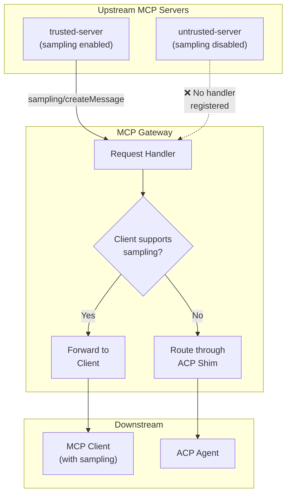
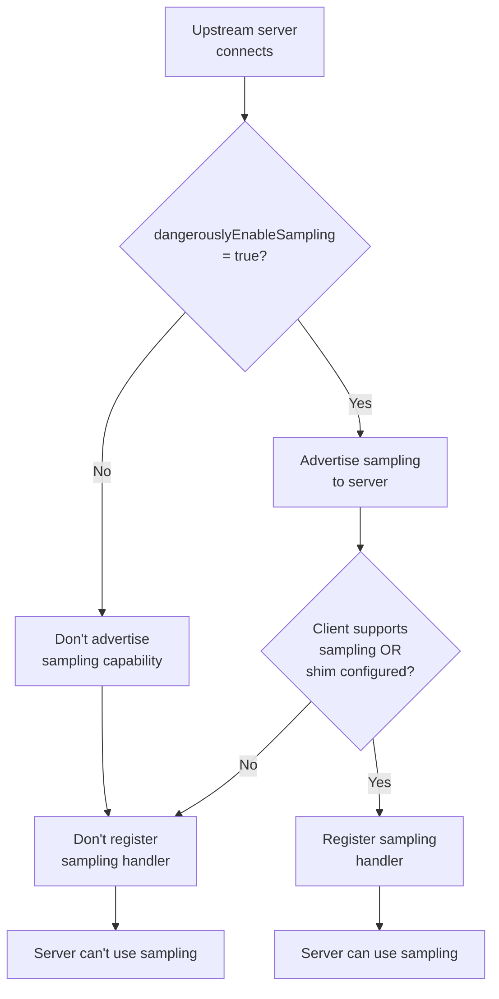
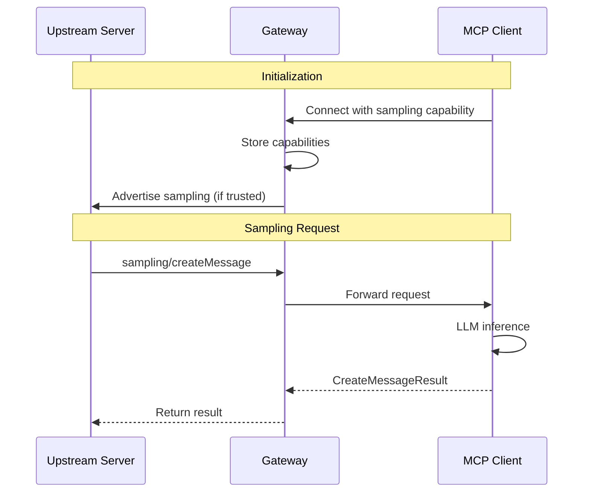
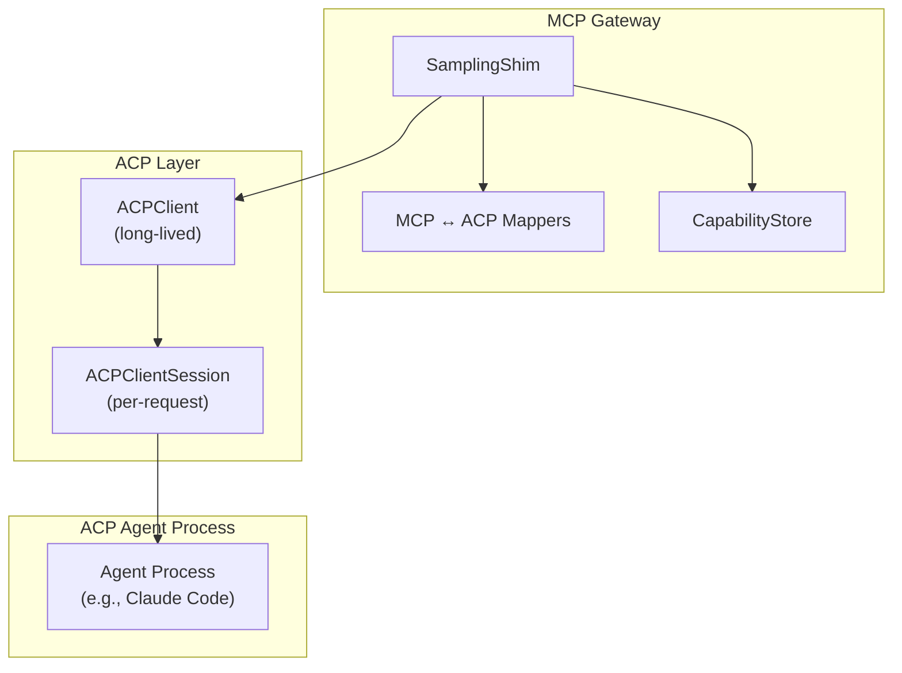
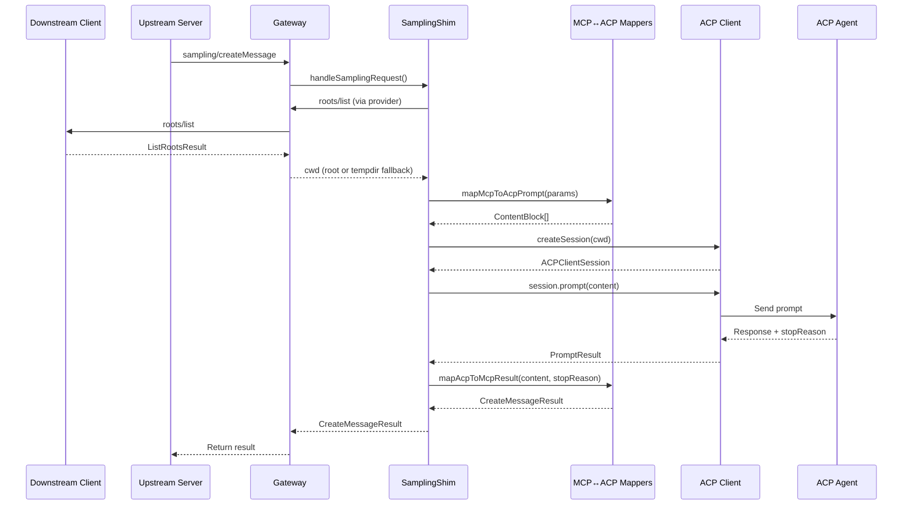
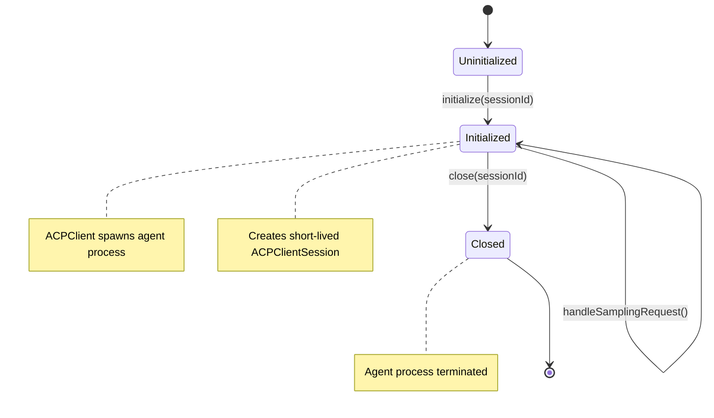
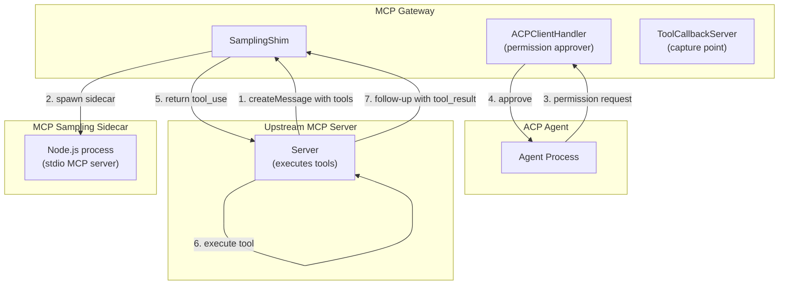
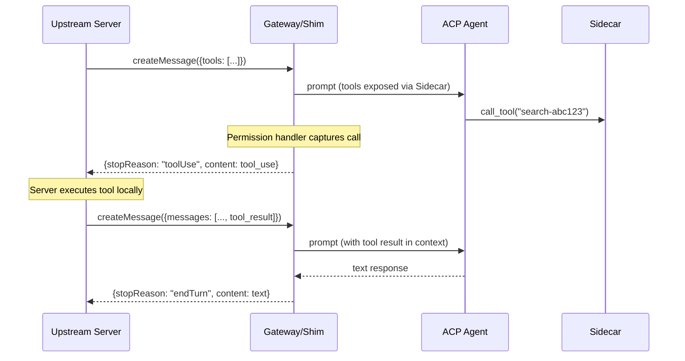
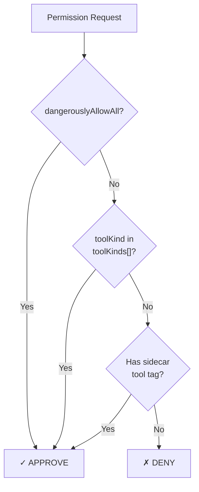

# Sampling

This document explains how the MCP Gateway Proxy handles `sampling/createMessage` requests from upstream MCP servers, including the ACP-based sampling shim for clients that lack native sampling support.

## Overview

MCP sampling allows upstream servers to request LLM inference through the client. The gateway supports two modes:

1. **Native Sampling** - Forward requests to a downstream client that supports sampling
2. **Sampling Shim** - Route requests through an ACP agent when the client doesn't support sampling

Both modes share the same security model: sampling is disabled by default and must be explicitly enabled per-server.



## Security Model

Sampling is a powerful capability that lets MCP servers request LLM inference. This creates significant security risk: a malicious server could use sampling to exfiltrate data, execute prompts, or abuse your AI credits.

### Defense-in-Depth

The gateway implements multiple security layers:

```mermaid
flowchart TB
    subgraph Layer1["Layer 1: Configuration"]
        Config["dangerouslyEnableSampling<br/>per-server setting"]
    end

    subgraph Layer2["Layer 2: Capability Filtering"]
        Advertise["Only advertise sampling<br/>to trusted servers"]
    end

    subgraph Layer3["Layer 3: Handler Registration"]
        Register["Only register handlers<br/>for trusted servers"]
    end

    Config --> Layer2
    Layer2 --> Layer3

    Untrusted["Untrusted Server"] -.->|"Can't see sampling exists"| Layer2
    Malicious["Malicious Server<br/>(guesses sampling)"| -.->|"No handler to process"| Layer3
```

| Layer                | Protection                           | Implementation                                   |
| -------------------- | ------------------------------------ | ------------------------------------------------ |
| Configuration        | Opt-in per server                    | `dangerouslyEnableSampling: true` in config      |
| Capability Filtering | Hide sampling from untrusted servers | `buildClientCapabilities()` in client-manager.ts |
| Handler Registration | No processing for untrusted servers  | `registerProxyHandlers()` in proxy-handlers.ts   |

### Trust Decision Flow



## Native Sampling

When the downstream MCP client advertises sampling support, requests are forwarded directly:



The gateway acts as a transparent proxy, preserving all request parameters:

- `messages` - Conversation history
- `systemPrompt` - System instructions
- `maxTokens` - Token limit
- `temperature` - Sampling temperature
- `modelPreferences` - Model selection hints
- `includeContext` - Context inclusion preference

## Sampling Shim

The sampling shim enables sampling support when the downstream client doesn't natively support it. It routes requests through an ACP (Agent Control Protocol) agent.

### Architecture



### Component Responsibilities

| Component             | Purpose                                           |
| --------------------- | ------------------------------------------------- |
| `SamplingShim`        | Thin orchestrator; lifecycle management           |
| `mapMcpToAcpPrompt()` | Convert MCP sampling params to ACP content blocks |
| `mapAcpToMcpResult()` | Convert ACP response to MCP CreateMessageResult   |
| `CapabilityStore`     | Track downstream client capabilities and working directories per session; provides session tempdir as fallback cwd |
| `ACPClient`           | Long-lived connection to agent process            |
| `ACPClientSession`    | Short-lived session per sampling request          |

### Request Flow



### Lifecycle Management



- **One ACPClient per gateway session** - Long-lived agent process
- **One ACPClientSession per sampling request** - Short-lived, isolated
- **Working directory** - Resolved lazily per request via `roots/list` on the downstream client. If the client advertises roots, the first valid local root is used as cwd (giving the agent access to the real project directory). Falls back to a session tempdir if roots/list fails, times out (5s), or returns no valid local paths.

> **Note:** `roots/list` is consumed at two distinct points in the session lifecycle:
> 1. **Session initialization** — sets the `cwd` for stdio upstream servers (via `startup.ts`)
> 2. **Sampling request time** — ACP working directory resolution (via `SamplingShim`)

## MCP ↔ ACP Mapping

The shim converts between MCP's sampling protocol and ACP's prompt protocol.

### MCP to ACP Conversion

| MCP Parameter                    | ACP Representation                                 |
| -------------------------------- | -------------------------------------------------- |
| `systemPrompt`                   | `[System]: {text}` text block                      |
| `messages[].role`                | `[User]:` or `[Assistant]:` prefix                 |
| `messages[].content` (text)      | Text content after role prefix                     |
| `messages[].content` (image)     | Native image block (if agent supports)             |
| `messages[].content` (audio)     | Native audio block (if agent supports)             |
| `temperature`, `maxTokens`, etc. | `[Sampling parameters: ...]` info block            |
| `tools`                          | Exposed via ephemeral MCP sidecar                  |
| `toolChoice.mode = "none"`       | Tools filtered out (sidecar not spawned)           |
| `toolChoice.mode = "required"`   | `[IMPORTANT: You MUST use ...]` directive injected |
| `toolChoice.mode = "auto"`       | Default behavior (no special handling)             |
| `includeContext`                 | Not mappable, skipped                              |

Example transformation:

```
MCP Request:
{
  systemPrompt: "You are helpful",
  messages: [
    { role: "user", content: { type: "text", text: "Hello" } },
    { role: "assistant", content: { type: "text", text: "Hi!" } }
  ],
  temperature: 0.7
}

ACP Content Blocks:
[
  { type: "text", text: "[System]: You are helpful" },
  { type: "text", text: "[User]: Hello" },
  { type: "text", text: "[Assistant]: Hi!" },
  { type: "text", text: "[Sampling parameters: temperature=0.7]" }
]
```

### ACP to MCP Conversion

| ACP Response       | MCP Result                                   |
| ------------------ | -------------------------------------------- |
| Text blocks        | Concatenated into single TextContent         |
| Image/audio blocks | First non-text block becomes primary content |
| `end_turn`         | `endTurn` stopReason                         |
| `max_tokens`       | `maxTokens` stopReason                       |
| `stop_sequence`    | `stopSequence` stopReason                    |
| Model info         | Always `"acp-agent"`                         |
| Role               | Always `"assistant"`                         |

## Tool Support (Spec-Compliant)

When an upstream server sends `tools` in the sampling request, the shim exposes them to the ACP agent via an MCP sidecar. Per the [MCP Sampling-with-Tools spec](https://modelcontextprotocol.io/specification/draft/client/sampling), tool execution is the **server's responsibility**, not the gateway's.

### Key Insight: Tool Capture, Not Execution

Instead of executing tools when the agent calls them, the gateway **captures** the tool call and returns it to the server:

1. Server sends `sampling/createMessage` with `tools` array
2. Agent attempts to call a tool
3. Gateway captures the call (not executes) and terminates the session
4. Gateway returns `tool_use` response with `stopReason: "toolUse"`
5. **Server executes the tool itself**
6. Server sends follow-up request with `tool_result`
7. Repeat until `stopReason !== "toolUse"`

### Architecture



### Multi-Turn Tool Flow



### Tool Capture Flow

Tool calls are captured to ensure spec compliance:

1. **Permission Handler**: Most ACP agents request permission before calling tools. The handler **approves** the permission request so the agent proceeds to call the sidecar.

2. **Callback Server (sole capture point)**: The sidecar POSTs the tool call — including full arguments — to the callback server. The callback server captures the call and returns an error to halt execution. The captured call is then returned to the upstream server as a `tool_use` response.

### Component Details

| Component              | Purpose                                     | Lifecycle            |
| ---------------------- | ------------------------------------------- | -------------------- |
| `ACPClientHandler`     | Approves sidecar tool permission requests   | Per-gateway-session  |
| `ToolCallbackServer`   | Captures tool calls with full arguments     | Per-sampling-request |
| `mcp-sampling-sidecar` | Exposes tools to agent via MCP              | Per-sampling-request |
| Tool tag               | UUID suffix for identifying sidecar tools   | Per-sampling-request |

### Tool Name Tagging

Tools are suffixed with a unique tag so the permission handler can identify sidecar tools:

```
Original tool: "search"
Tagged tool:   "search-a1b2c3d4"
```

The original name is extracted when capturing, and that's what's returned in the `tool_use` response.

### Spec References

| Concept                           | Specification                                                                                             |
| --------------------------------- | --------------------------------------------------------------------------------------------------------- |
| Multi-turn tool loop              | [Sampling with Tools](https://modelcontextprotocol.io/specification/draft/client/sampling)                |
| CreateMessageResult with tool_use | [Schema: CreateMessageResult](https://modelcontextprotocol.io/specification/2025-11-25/schema)            |
| Server executes tools             | [SEP-1577: Sampling With Tools](https://modelcontextprotocol.io/community/seps/1577--sampling-with-tools) |

## ACP Permission Auto-Approval

When using the ACP shim, the gateway can auto-approve permission requests from the agent based on tool kind. This provides fine-grained control over what actions the shim agent can perform.

### AllowOwnToolsConfig Interface

```typescript
interface AllowOwnToolsConfig {
  /**
   * DANGEROUS: Auto-approve ALL permission requests regardless of tool kind.
   * Supersedes toolKinds if set to true.
   * Default: false
   */
  dangerouslyAllowAll?: boolean;

  /**
   * List of tool kinds to auto-approve.
   * Default: [] (no auto-approval by kind)
   */
  toolKinds?: ToolKind[];
}
```

### Valid Tool Kinds

| Tool Kind     | Description                                 |
| ------------- | ------------------------------------------- |
| `read`        | Reading files or data                       |
| `edit`        | Modifying existing content                  |
| `delete`      | Removing files or data                      |
| `move`        | Moving or renaming files                    |
| `search`      | Searching through content                   |
| `execute`     | Running commands or scripts                 |
| `think`       | Internal reasoning/planning operations      |
| `fetch`       | Network requests or external data retrieval |
| `switch_mode` | Changing operational modes                  |
| `other`       | Uncategorized operations                    |

### Permission Check Priority

Permission requests are evaluated in this order:

1. **dangerouslyAllowAll** - If true, approve immediately
2. **toolKinds** - If tool kind is in the list, approve
3. **Sidecar tool tag** - If tool name contains the session's sidecar tag, approve
4. **Default deny** - All other requests are denied



### Example Configuration

```json
{
  "acp": {
    "agent": {
      "command": "npx",
      "args": ["@zed-industries/claude-code-acp"]
    },
    "allowOwnTools": {
      "toolKinds": ["read", "search", "think"]
    }
  }
}
```

Implementation in `packages/acp-client/src/acp-client.ts`.

## Configuration

### Enabling Sampling Per-Server

```json
{
  "mcpClients": {
    "trusted-server": {
      "type": "http",
      "url": "http://localhost:3000/mcp",
      "dangerouslyEnableSampling": true
    },
    "untrusted-server": {
      "type": "http",
      "url": "http://localhost:3001/mcp"
    }
  }
}
```

Without `dangerouslyEnableSampling: true`, sampling is disabled by default.

### Configuring the ACP Shim

```json
{
  "acp": {
    "agent": {
      "command": "npx",
      "args": ["@zed-industries/claude-code-acp"]
    }
  }
}
```

The configured command must be an ACP-compliant agent. Note that Claude Code does not natively implement ACP — use a wrapper package like `@zed-industries/claude-code-acp` to expose it as an ACP agent. See the [ACP agents directory](https://agentclientprotocol.com/get-started/agents) for other options.

### Behavior Matrix

| Client has sampling? | ACP agent configured? | Result                      |
| -------------------- | --------------------- | --------------------------- |
| Yes                  | Don't care            | Native sampling (preferred) |
| No                   | Yes                   | ACP agent handles sampling  |
| No                   | No                    | Sampling unavailable        |

Native client sampling always takes priority over the shim.

## Implementation Files

| File                                                | Purpose                                       |
| --------------------------------------------------- | --------------------------------------------- |
| `apps/gateway/src/services/sampling-shim.ts`        | Shim orchestrator, checks both capture points |
| `apps/gateway/src/utils/mcp-acp-mappers.ts`         | MCP ↔ ACP conversion                          |
| `apps/gateway/src/services/tool-callback-server.ts` | Fallback capture server for tool calls        |
| `apps/gateway/src/services/capability-store.ts`     | Session capability and cwd tracking           |
| `apps/gateway/src/handlers/proxy-handlers.ts`       | Handler registration logic                    |
| `packages/acp-client/src/acp-client.ts`             | Permission handler with tool call capture     |
| `packages/acp-client/src/acp-client-session.ts`     | Exposes getCapturedToolCall() to shim         |
| `packages/acp-client/src/types.ts`                  | AllowOwnToolsConfig interface                 |
| `packages/mcp-client/src/client-manager.ts`         | Capability advertising                        |
| `packages/mcp-sampling-sidecar/src/index.ts`        | Exposes tools to agent, handles capture       |

## Best Practices

### For Contributors

1. **Never bypass security layers** - Always check `dangerouslyEnableSampling`
2. **Handle shim cleanup** - Close callback servers in finally blocks
3. **Test both paths** - Cover native sampling and shim modes
4. **Respect capability negotiation** - Check agent's `promptCapabilities`
5. **Capture, don't execute** - Tool calls from sampling requests are captured and returned to the server

### For Operators

1. **Minimize trusted servers** - Only enable sampling where necessary
2. **Use tool filtering** - Combine with `allowedTools` for defense-in-depth
3. **Monitor sampling usage** - Track which servers make sampling requests
4. **Choose appropriate ACP agent** - Balance capability vs. security

### For Server Implementers

When sending sampling requests with tools, be prepared to handle the multi-turn flow:

1. Check `stopReason` in the response
2. If `stopReason === "toolUse"`, execute the tool locally
3. Send a follow-up request with the `tool_result` appended to messages
4. Continue until `stopReason !== "toolUse"`

## Related Documentation

- [Session Management](./session-management.md) - Session isolation for sampling handlers
- [Configuration Guide](../configuration.md) - Full sampling configuration reference
- [Index](./index.md) - High-level architecture overview
