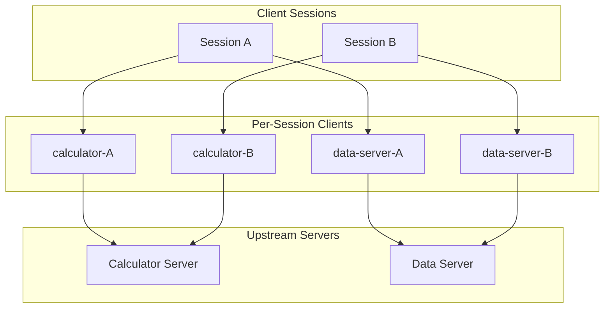
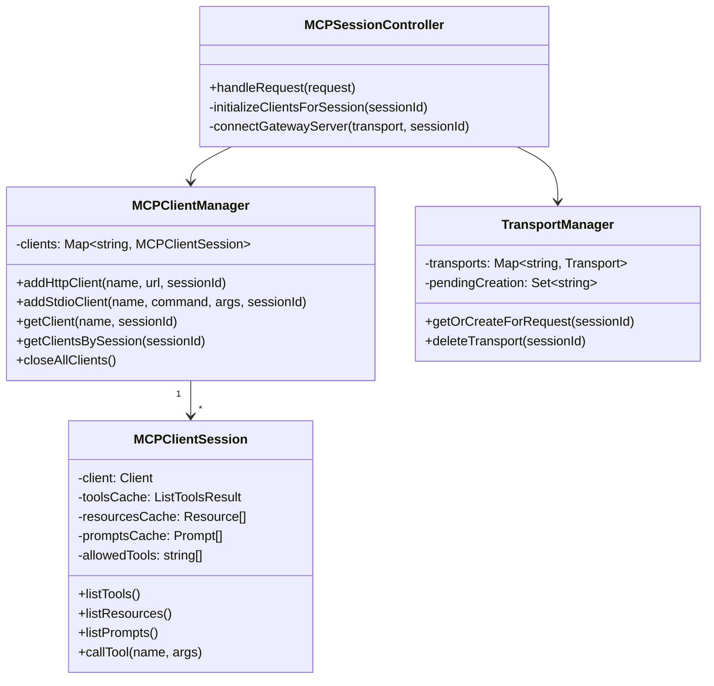
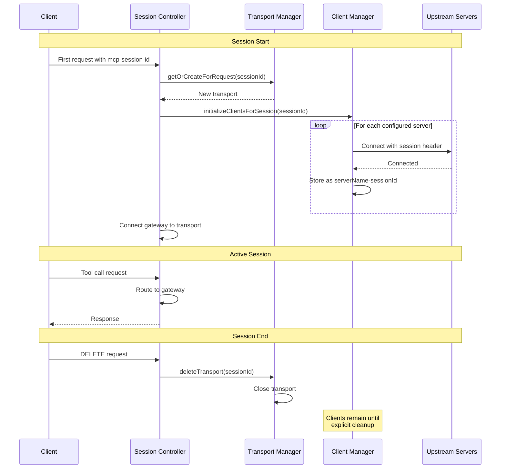
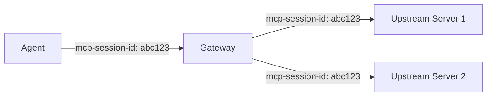
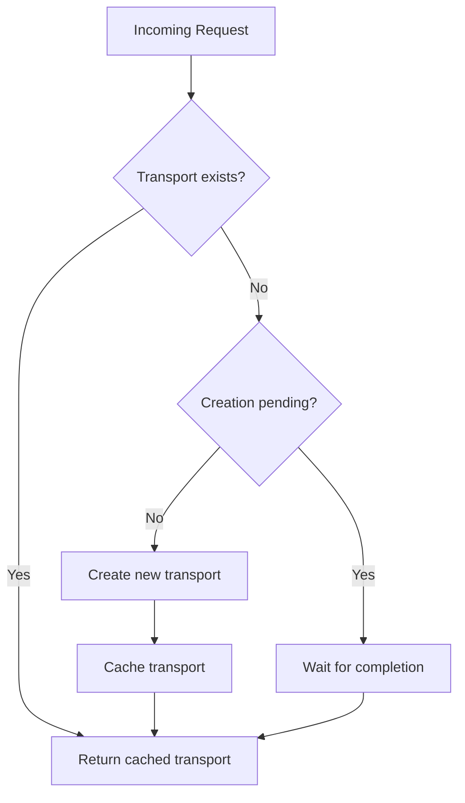
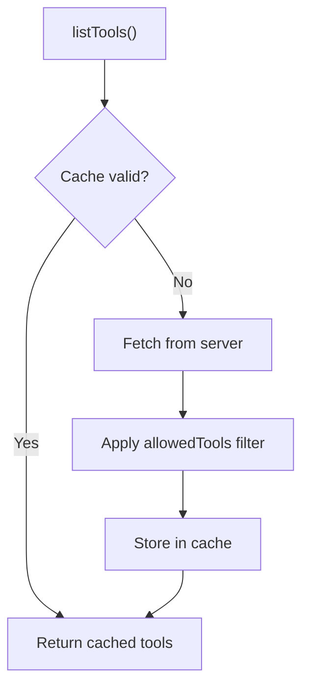
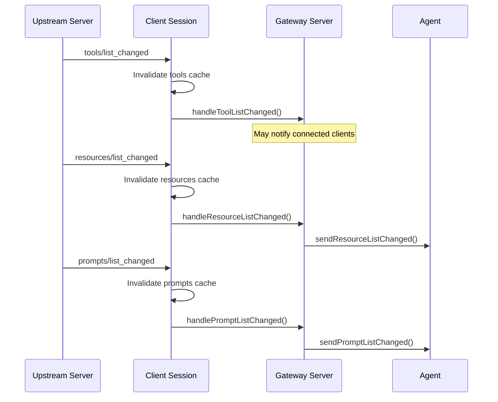

# Session Management

This document explains how the MCP Gateway Proxy manages sessions, client connections, and ensures isolation between concurrent users.

## Overview

In HTTP mode, each client gets an isolated session with:

- Dedicated MCP client connections to upstream servers
- Separate caches for tools, resources, and prompts
- Session ID propagation to upstream servers



## Client Keying Strategy

MCP clients are stored in a map keyed by `${serverName}-${sessionId}`:

| Session     | Server      | Client Key                |
| ----------- | ----------- | ------------------------- |
| session-123 | calculator  | `calculator-session-123`  |
| session-123 | data-server | `data-server-session-123` |
| session-456 | calculator  | `calculator-session-456`  |
| default     | calculator  | `calculator-default`      |

This ensures complete isolation between sessions.

## Component Relationships



## Session Lifecycle (HTTP Mode)



## Session ID Handling

### Sources of Session IDs

1. **Client-provided** - Via `mcp-session-id` header
2. **Generated pending** - If no header: `pending-${timestamp}-${random}`
3. **Fixed default** - Stdio mode always uses "default"

### Session ID Propagation

Session IDs are passed to upstream HTTP servers:



**Exception:** Pending and default session IDs are NOT propagated to avoid conflicts:

- `pending-*` IDs are temporary and shouldn't create upstream sessions
- `default` is reserved for stdio mode

Implementation in `src/mcp/client-manager.ts`:

```typescript
const headers: Record<string, string> = { ...config.headers };
if (sessionId !== "default" && !sessionId.startsWith("pending-")) {
  headers["mcp-session-id"] = sessionId;
}
```

## Transport Management

The `TransportManager` handles HTTP transport lifecycle:

### Transport Caching



### Race Condition Prevention

Multiple concurrent requests might try to create the same transport. The manager uses:

- `pendingCreation` Set to track in-progress creations
- Polling loop (10ms intervals) to wait for pending transports
- Cleanup of stale pending entries after 30 seconds

### Transport Cleanup

When a transport closes:

1. `onclose` handler fires
2. Both the SDK-generated and original session IDs are removed from cache
3. Resources are freed

## Client Session Features

Each `MCPClientSession` wraps an MCP client with:

### Tool Caching



Cache invalidation:

- On `tools/list_changed` notification from upstream
- Cache is cleared, next call fetches fresh data

### Tool Filtering

Optional `allowedTools` configuration restricts which tools are exposed:

```json
{
  "mcpClients": {
    "server": {
      "type": "http",
      "url": "...",
      "allowedTools": ["safe_tool", "another_tool"]
    }
  }
}
```

Filtering happens in `MCPClientSession.listTools()`:

- If `allowedTools` is set, only matching tools are returned
- If not set, all tools are available

### Resource/Prompt Caching

Similar caching pattern for resources and prompts:

- Cached after first fetch
- Invalidated on `resources/list_changed` or `prompts/list_changed`
- Supports pagination for large collections

## Notification Handling

Upstream servers can notify about changes:



## Stdio Mode Differences

| Aspect             | HTTP Mode                | Stdio Mode         |
| ------------------ | ------------------------ | ------------------ |
| Session ID         | From header or generated | Fixed "default"    |
| Client init        | Lazy (on first request)  | Eager (at startup) |
| Multiple sessions  | Yes                      | No                 |
| Transport manager  | Used                     | Not used           |
| Session controller | Used                     | Not used           |

In stdio mode:

- All clients initialized during `startStdioMode()`
- Single gateway server connects to `StdioServerTransport`
- No session isolation needed

## Implementation Files

| File                                        | Purpose                             |
| ------------------------------------------- | ----------------------------------- |
| `src/mcp/client-manager.ts`                 | Client lifecycle and session keying |
| `src/mcp/client-session.ts`                 | Per-client caching and filtering    |
| `src/mcp/transport-manager.ts`              | HTTP transport caching              |
| `src/controllers/mcp-session-controller.ts` | Request routing and session init    |

## Best Practices

### For Contributors

1. **Always use session-scoped clients** - Never share clients between sessions
2. **Handle cache invalidation** - Subscribe to notification handlers
3. **Clean up resources** - Close clients when sessions end
4. **Propagate session IDs** - Pass through to upstream where appropriate

### For Operators

1. **Monitor session counts** - Many sessions = many upstream connections
2. **Configure allowed tools** - Limit exposure per server if needed
3. **Set reasonable timeouts** - Prevent orphaned sessions

## Related Documentation

- [Transport Modes](./transport-modes.md) - HTTP vs stdio transport details
- [Index](./index.md) - High-level architecture overview
