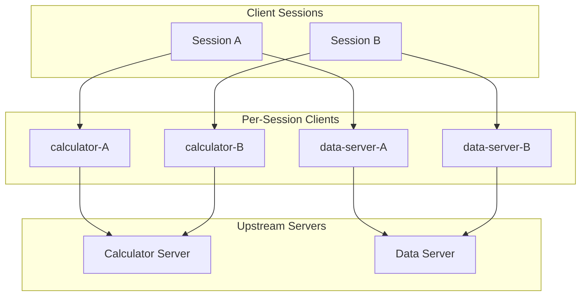
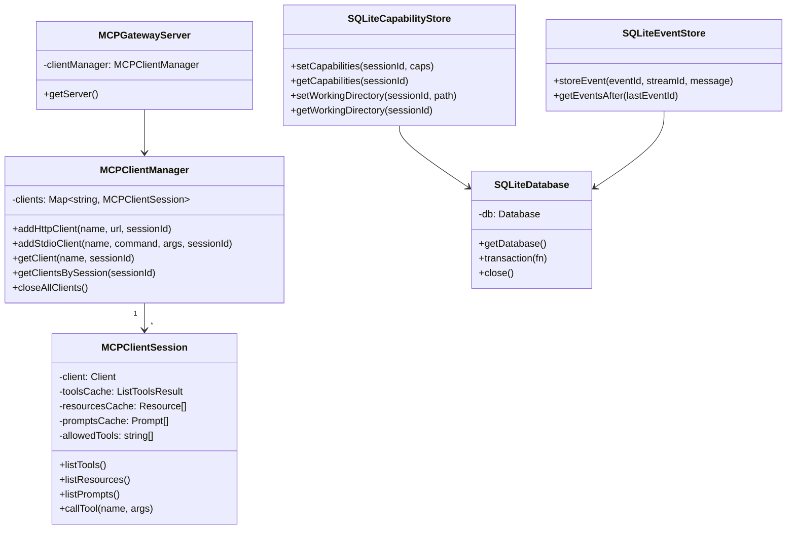
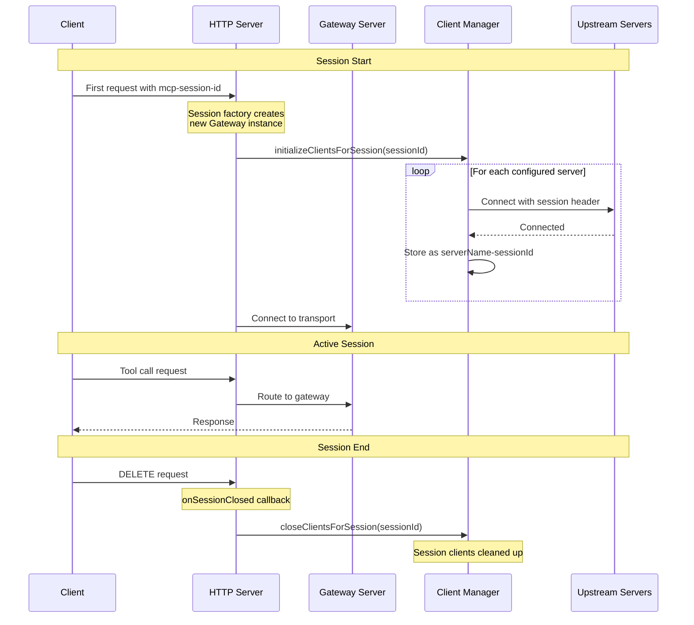
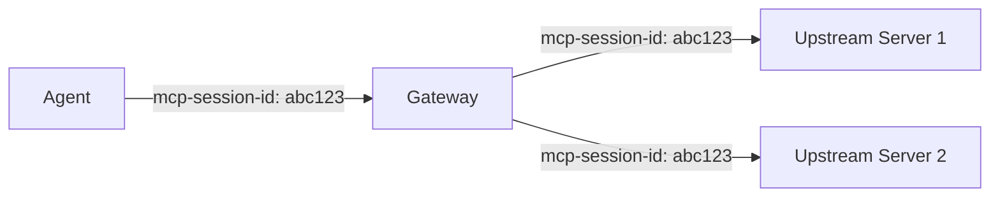
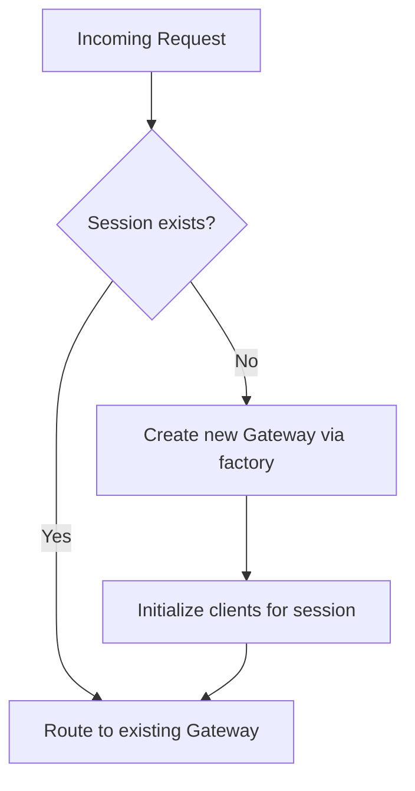
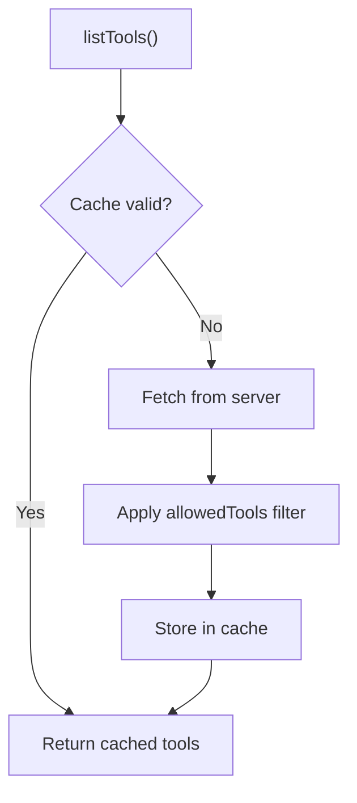
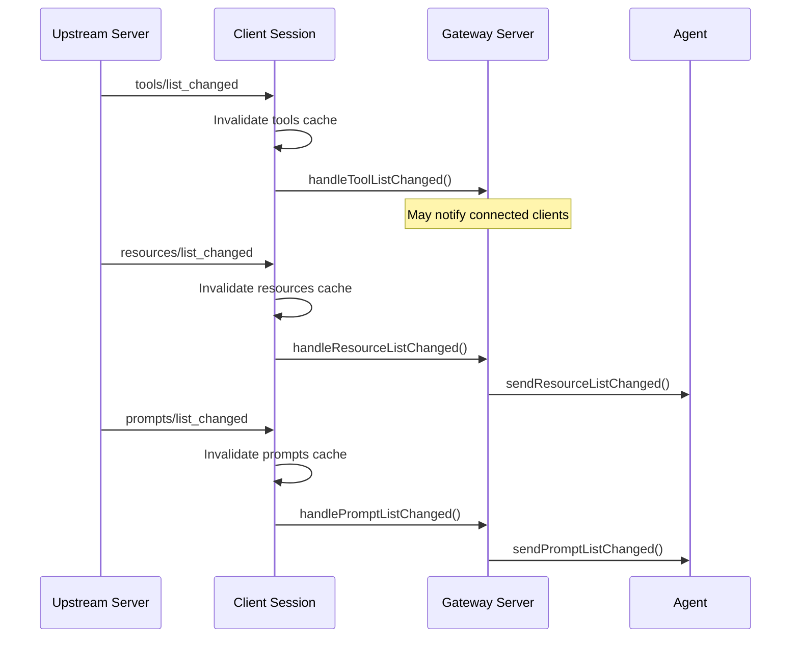
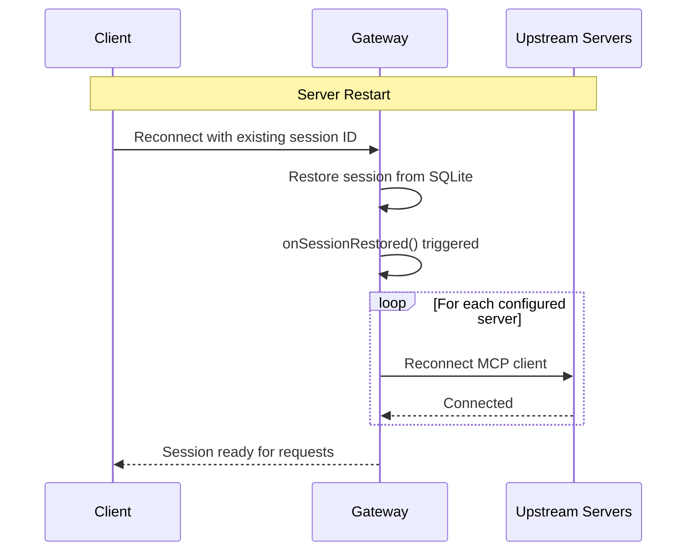

# Session Management

This document explains how the MCP Gateway Proxy manages sessions, client connections, and ensures isolation between concurrent users.

## Overview

In HTTP mode, each client gets an isolated session with:

- Dedicated MCP client connections to upstream servers
- Separate caches for tools, resources, and prompts
- Session ID propagation to upstream servers


```mermaid
flowchart TB
    subgraph Sessions["Client Sessions"]
        S1["Session A"]
        S2["Session B"]
    end

    subgraph Clients["Per-Session Clients"]
        S1 --> C1A["calculator-A"]
        S1 --> C1B["data-server-A"]
        S2 --> C2A["calculator-B"]
        S2 --> C2B["data-server-B"]
    end

    subgraph Upstream["Upstream Servers"]
        Calc["Calculator Server"]
        Data["Data Server"]
    end

    C1A --> Calc
    C2A --> Calc
    C1B --> Data
    C2B --> Data
```

## Client Keying Strategy

MCP clients are stored in a map keyed by `${serverName}-${sessionId}`:

| Session     | Server      | Client Key                |
| ----------- | ----------- | ------------------------- |
| session-123 | calculator  | `calculator-session-123`  |
| session-123 | data-server | `data-server-session-123` |
| session-456 | calculator  | `calculator-session-456`  |
| default     | calculator  | `calculator-default`      |

This ensures complete isolation between sessions.

## Component Relationships


```mermaid
classDiagram
    class MCPClientManager {
        -clients: Map~string, MCPClientSession~
        +addHttpClient(name, url, sessionId)
        +addStdioClient(name, command, args, sessionId)
        +getClient(name, sessionId)
        +getClientsBySession(sessionId)
        +closeAllClients()
    }

    class MCPClientSession {
        -client: Client
        -toolsCache: ListToolsResult
        -resourcesCache: Resource[]
        -promptsCache: Prompt[]
        -allowedTools: string[]
        +listTools()
        +listResources()
        +listPrompts()
        +callTool(name, args)
    }

    class MCPGatewayServer {
        -clientManager: MCPClientManager
        +getServer()
    }

    class SQLiteDatabase {
        -db: Database
        +getDatabase()
        +transaction(fn)
        +close()
    }

    class SQLiteCapabilityStore {
        +setCapabilities(sessionId, caps)
        +getCapabilities(sessionId)
        +setWorkingDirectory(sessionId, path)
        +getWorkingDirectory(sessionId)
    }

    class SQLiteEventStore {
        +storeEvent(eventId, streamId, message)
        +getEventsAfter(lastEventId)
    }

    MCPClientManager "1" --> "*" MCPClientSession
    MCPGatewayServer --> MCPClientManager
    SQLiteCapabilityStore --> SQLiteDatabase
    SQLiteEventStore --> SQLiteDatabase
```

## Session Lifecycle (HTTP Mode)


```mermaid
sequenceDiagram
    participant Client
    participant HTTP as HTTP Server
    participant Gateway as Gateway Server
    participant ClientMgr as Client Manager
    participant Upstream as Upstream Servers

    Note over Client,Upstream: Session Start
    Client->>HTTP: First request with mcp-session-id
    Note over HTTP: Session factory creates<br/>new Gateway instance
    HTTP->>ClientMgr: initializeClientsForSession(sessionId)

    loop For each configured server
        ClientMgr->>Upstream: Connect with session header
        Upstream-->>ClientMgr: Connected
        ClientMgr->>ClientMgr: Store as serverName-sessionId
    end

    HTTP->>Gateway: Connect to transport

    Note over Client,Upstream: Active Session
    Client->>HTTP: Tool call request
    HTTP->>Gateway: Route to gateway
    Gateway-->>Client: Response

    Note over Client,Upstream: Session End
    Client->>HTTP: DELETE request
    Note over HTTP: onSessionClosed callback
    HTTP->>ClientMgr: closeClientsForSession(sessionId)
    Note over ClientMgr: Session clients cleaned up
```

## Session ID Handling

### Sources of Session IDs

1. **Client-provided** - Via `mcp-session-id` header
2. **Generated pending** - If no header: `pending-${timestamp}-${random}`
3. **Fixed default** - Stdio mode always uses "default"

### Session ID Propagation

Session IDs are passed to upstream HTTP servers:


```mermaid
flowchart LR
    Agent["Agent"] -->|"mcp-session-id: abc123"| Gateway["Gateway"]
    Gateway -->|"mcp-session-id: abc123"| Server1["Upstream Server 1"]
    Gateway -->|"mcp-session-id: abc123"| Server2["Upstream Server 2"]
```

**Exception:** Pending and default session IDs are NOT propagated to avoid conflicts:

- `pending-*` IDs are temporary and shouldn't create upstream sessions
- `default` is reserved for stdio mode

Implementation in `packages/mcp-client/src/client-manager.ts`:

```typescript
const headers: Record<string, string> = { ...config.headers };
if (sessionId !== "default" && !sessionId.startsWith("pending-")) {
  headers["mcp-session-id"] = sessionId;
}
```

## Session Management

Session management is handled via the `@karashiiro/mcp` abstraction layer in `apps/gateway/src/index.ts`:

### Session Factory Pattern


```mermaid
flowchart TB
    Request["Incoming Request"] --> Check{"Session exists?"}
    Check -->|Yes| Route["Route to existing Gateway"]
    Check -->|No| Create["Create new Gateway via factory"]
    Create --> Init["Initialize clients for session"]
    Init --> Route
```

### Session Lifecycle Callbacks

The HTTP server uses three callbacks for session management:

- `sessionFactory`: Creates a new `MCPGatewayServer` instance for each session
- `onSessionInitialized`: Called after session is ready, initializes MCP clients
- `onSessionClosed`: Cleans up session resources (closes clients)

## Client Session Features

Each `MCPClientSession` wraps an MCP client with:

### Tool Caching


```mermaid
flowchart TB
    ListTools["listTools()"] --> Cached{"Cache valid?"}
    Cached -->|Yes| ReturnCache["Return cached tools"]
    Cached -->|No| Fetch["Fetch from server"]
    Fetch --> Filter["Apply allowedTools filter"]
    Filter --> Store["Store in cache"]
    Store --> ReturnCache
```

Cache invalidation:

- On `tools/list_changed` notification from upstream
- Cache is cleared, next call fetches fresh data

### Tool Filtering

Optional `allowedTools` configuration restricts which tools are exposed:

```json
{
  "mcpClients": {
    "server": {
      "type": "http",
      "url": "...",
      "allowedTools": ["safe_tool", "another_tool"]
    }
  }
}
```

Filtering happens in `MCPClientSession.listTools()`:

- If `allowedTools` is set, only matching tools are returned
- If not set, all tools are available

### Resource/Prompt Caching

Similar caching pattern for resources and prompts:

- Cached after first fetch
- Invalidated on `resources/list_changed` or `prompts/list_changed`
- Supports pagination for large collections

## Notification Handling

Upstream servers can notify about changes:


```mermaid
sequenceDiagram
    participant Upstream as Upstream Server
    participant Session as Client Session
    participant Gateway as Gateway Server
    participant Agent

    Upstream->>Session: tools/list_changed
    Session->>Session: Invalidate tools cache
    Session->>Gateway: handleToolListChanged()
    Note over Gateway: May notify connected clients

    Upstream->>Session: resources/list_changed
    Session->>Session: Invalidate resources cache
    Session->>Gateway: handleResourceListChanged()
    Gateway->>Agent: sendResourceListChanged()

    Upstream->>Session: prompts/list_changed
    Session->>Session: Invalidate prompts cache
    Session->>Gateway: handlePromptListChanged()
    Gateway->>Agent: sendPromptListChanged()
```

### Logging Message Forwarding

The gateway forwards `notifications/message` (logging) notifications from upstream servers to downstream clients. The gateway advertises the "logging" capability to upstream servers.

**Source Identification**: Log messages are prefixed with `[server-name]` so downstream clients can identify which upstream server generated the log:

```
Original logger: "database"
Forwarded logger: "[postgres-server] database"
```

Implementation in `packages/mcp-client/src/client-session.ts` (log message forwarding):

```typescript
const prefixedLogger = originalLogger
  ? `[${this.serverName}] ${originalLogger}`
  : `[${this.serverName}]`;
```

## Session Persistence (HTTP Mode)

In HTTP mode, session state is automatically persisted to SQLite, enabling session resumability across server restarts.

### SQLite Components

| Component               | Purpose                                              |
| ----------------------- | ---------------------------------------------------- |
| `SQLiteDatabase`        | Database connection and schema management            |
| `SQLiteCapabilityStore` | Persists client capabilities and working directories |
| `SQLiteEventStore`      | Persists SSE events for resumability                 |

### Database Location

Session data is stored at platform-specific locations:

| Platform    | Path                                                      |
| ----------- | --------------------------------------------------------- |
| **Linux**   | `~/.local/share/my-cool-proxy/sessions.db`                |
| **macOS**   | `~/Library/Application Support/my-cool-proxy/sessions.db` |
| **Windows** | `%LOCALAPPDATA%\my-cool-proxy\Data\sessions.db`           |

### Configuration

- **WAL Mode**: Enabled for better concurrent access and crash recovery
- **Event Retention**: 1000 events per session (FIFO eviction when exceeded)
- **Session TTL**: 5 minutes (`SESSION_TTL_MS`) of inactivity before expiration

### Implementation Files

| File                                                 | Purpose                          |
| ---------------------------------------------------- | -------------------------------- |
| `apps/gateway/src/stores/sqlite-database.ts`         | Database connection wrapper      |
| `apps/gateway/src/stores/sqlite-capability-store.ts` | Session capability persistence   |
| `apps/gateway/src/stores/sqlite-event-store.ts`      | SSE event persistence            |
| `apps/gateway/src/utils/db-paths.ts`                 | Platform-specific database paths |

## Session Restoration

When the gateway restarts, persisted sessions can be restored automatically.

### onSessionRestored Callback

The `onSessionRestored` callback handles session restoration:

1. Triggered when a client reconnects with a previously-stored session ID
2. Re-initializes upstream MCP client connections
3. Blocks incoming requests until upstream servers are ready


```mermaid
sequenceDiagram
    participant Client
    participant Gateway
    participant Upstream as Upstream Servers

    Note over Client,Upstream: Server Restart
    Client->>Gateway: Reconnect with existing session ID
    Gateway->>Gateway: Restore session from SQLite
    Gateway->>Gateway: onSessionRestored() triggered

    loop For each configured server
        Gateway->>Upstream: Reconnect MCP client
        Upstream-->>Gateway: Connected
    end

    Gateway-->>Client: Session ready for requests
```

### SSE Event Resumability

When clients reconnect, they can provide a `Last-Event-ID` header. The gateway replays events after that ID from the SQLite event store, ensuring no messages are lost during disconnections.

## Stdio Mode Differences

| Aspect              | HTTP Mode                  | Stdio Mode            |
| ------------------- | -------------------------- | --------------------- |
| Session ID          | From header or generated   | Fixed "default"       |
| Client init         | Lazy (on first request)    | Eager (at startup)    |
| Multiple sessions   | Yes                        | No                    |
| Server factory      | `serveHttp()` with factory | `serveStdio()` direct |
| Gateway instances   | One per session            | Single instance       |
| Session persistence | SQLite-backed              | Not used              |

In stdio mode:

- All clients initialized at startup via `serveStdio()`
- Single gateway server connects to stdio transport
- No session isolation needed
- Session persistence is not used (single fixed session)

## Implementation Files

| File                                        | Purpose                                          |
| ------------------------------------------- | ------------------------------------------------ |
| `apps/gateway/src/index.ts`                 | Session factory and lifecycle callbacks          |
| `packages/mcp-client/src/client-manager.ts` | Client lifecycle and session keying              |
| `packages/mcp-client/src/client-session.ts` | Per-client caching and filtering                 |
| `apps/gateway/src/mcp/gateway-server.ts`    | Per-session Gateway server with tool integration |

## Best Practices

### For Contributors

1. **Always use session-scoped clients** - Never share clients between sessions
2. **Handle cache invalidation** - Subscribe to notification handlers
3. **Clean up resources** - Close clients when sessions end
4. **Propagate session IDs** - Pass through to upstream where appropriate

### For Operators

1. **Monitor session counts** - Many sessions = many upstream connections
2. **Configure allowed tools** - Limit exposure per server if needed
3. **Set reasonable timeouts** - Prevent orphaned sessions

## Related Documentation

- [Transport Modes](./transport-modes.md) - HTTP vs stdio transport details
- [Index](./index.md) - High-level architecture overview
