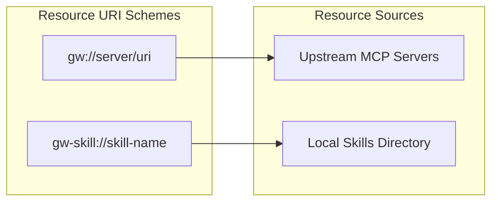
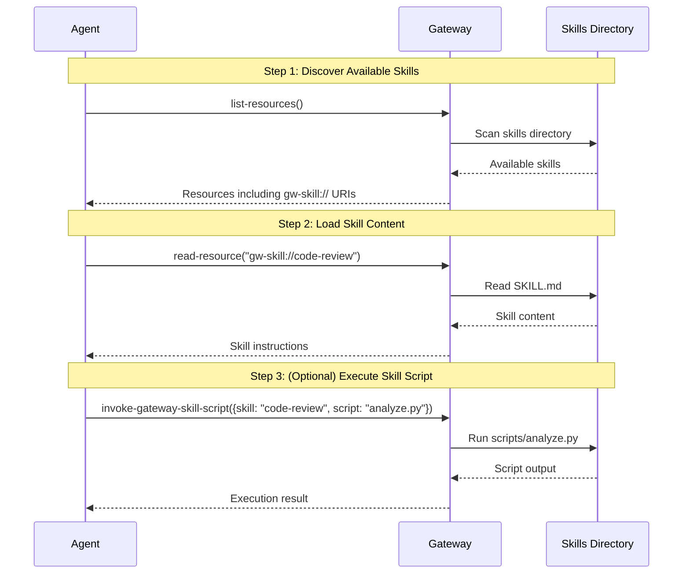
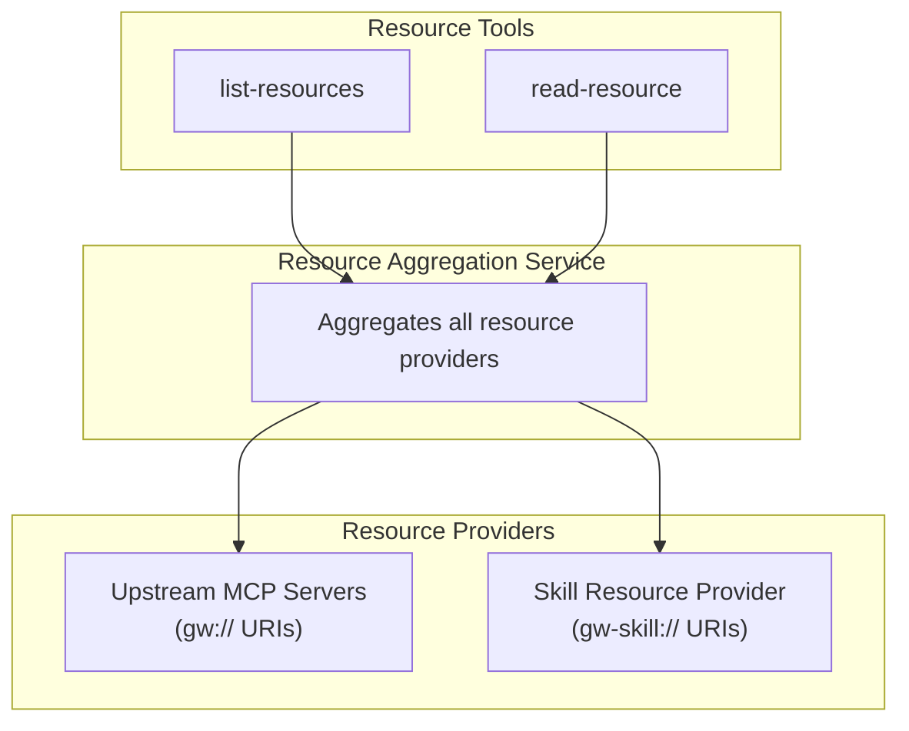

# Skills

Skills are reusable instruction sets that extend the gateway's capabilities for AI agents. They package process documentation, executable scripts, reference materials, and data assets into discoverable MCP resources.

## Why Skills?

AI agents often need structured guidance for complex tasks. Skills solve this by:

- **Reusability** - Write once, use across multiple sessions and agents
- **Discoverability** - Exposed as MCP resources that agents can find and load
- **Composability** - Skills can include scripts, references, and assets
- **Portability** - Skills live in standard directories, easy to share

## Skills as MCP Resources

Skills integrate with the gateway's resource system using a dedicated URI scheme:

```
gw-skill://{skill-name}              → Main SKILL.md content
gw-skill://{skill-name}/{path}       → Nested resources (scripts/, references/, assets/)
```

This is separate from the `gw://` scheme used for upstream server resources. The `gw-skill://` scheme indicates gateway-local skills rather than proxied resources.



## Discovery Workflow

Agents discover and use skills through standard MCP resource operations:



## Skill Directory Structure

Skills are stored in the platform-specific config directory:

| Platform | Location                                      |
| -------- | --------------------------------------------- |
| Windows  | `%APPDATA%\my-cool-proxy\skills\`             |
| macOS    | `~/Library/Preferences/my-cool-proxy/skills/` |
| Linux    | `~/.config/my-cool-proxy/skills/`             |

Each skill is a subdirectory containing:

```
skills/
  code-review/
    SKILL.md              # Required - main content with YAML frontmatter
    scripts/              # Optional - executable scripts
      analyze.py
      lint.sh
    references/           # Optional - reference documentation
      CONVENTIONS.md
      API.md
    assets/               # Optional - data files
      config-template.json
      prompts.yaml
```

### SKILL.md Format

The main skill file uses YAML frontmatter followed by markdown content:

```markdown
---
name: code-review
description: Analyze code for quality, maintainability, and test coverage
---

# Code Review Skill

Instructions for the agent on how to perform code reviews...
```

## Gateway Tools for Skills

When skills are enabled, these tools become available:

| Tool                          | Requires                                          | Description                                          |
| ----------------------------- | ------------------------------------------------- | ---------------------------------------------------- |
| `invoke-gateway-skill-script` | `skills.enabled: true`                            | Execute a script from a skill's `scripts/` directory |
| `write-gateway-skill`         | `skills.enabled: true` AND `skills.mutable: true` | Create or modify skills                              |

## Configuration

Skills are disabled by default. Enable them in your gateway configuration:

```json
{
  "skills": {
    "enabled": true,
    "mutable": false
  }
}
```

- **`enabled`**: When `true`, skills are exposed as MCP resources
- **`mutable`**: When `true`, agents can create and modify skills

See the [Configuration Guide](../configuration.md#skills) for detailed configuration options.

## Implementation Details

### Key Components

| Component                      | File                                            | Purpose                                         |
| ------------------------------ | ----------------------------------------------- | ----------------------------------------------- |
| `SkillDiscoveryService`        | `src/services/skill-discovery-service.ts`       | Scans skill directories, resolves skill content |
| `SkillResourceProvider`        | `src/services/skill-resource-provider.ts`       | Provides skills as MCP resources                |
| `InvokeGatewaySkillScriptTool` | `src/tools/invoke-gateway-skill-script-tool.ts` | Executes skill scripts                          |
| `WriteGatewaySkillTool`        | `src/tools/write-gateway-skill-tool.ts`         | Creates/modifies skills                         |

### Resource Integration

Skills integrate with the resource aggregation system:



## Built-in Skills

The gateway includes a built-in skill:

- **`writing-gateway-skills`** - Instructions for creating new skills, always available when skills are enabled

## Security Considerations

- Scripts execute in the gateway's process context
- Use `mutable: false` in production to prevent unauthorized skill modifications
- Review skill scripts before deploying to shared environments
