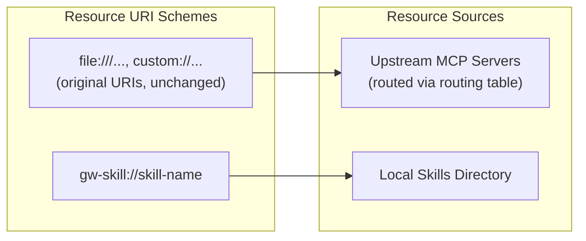
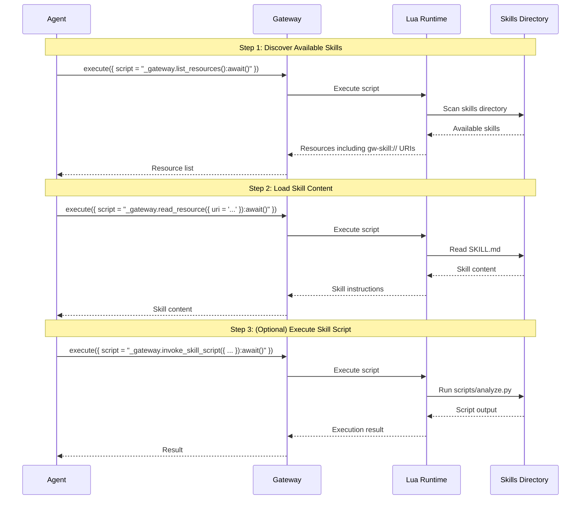
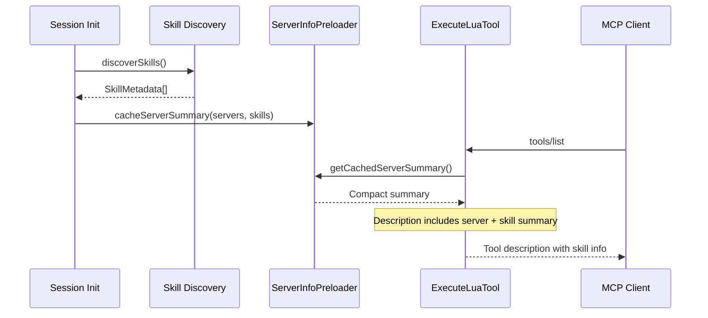
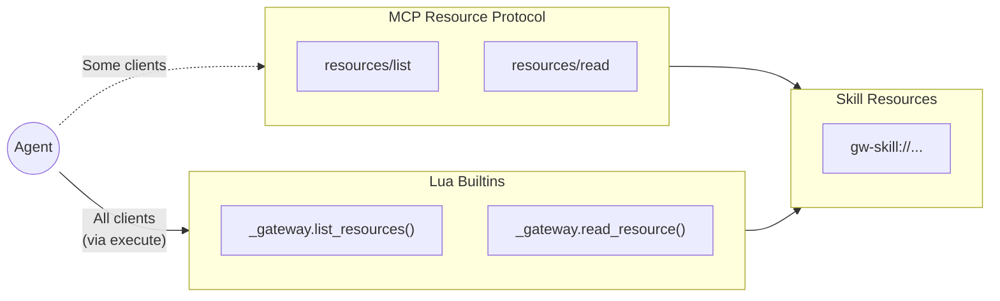
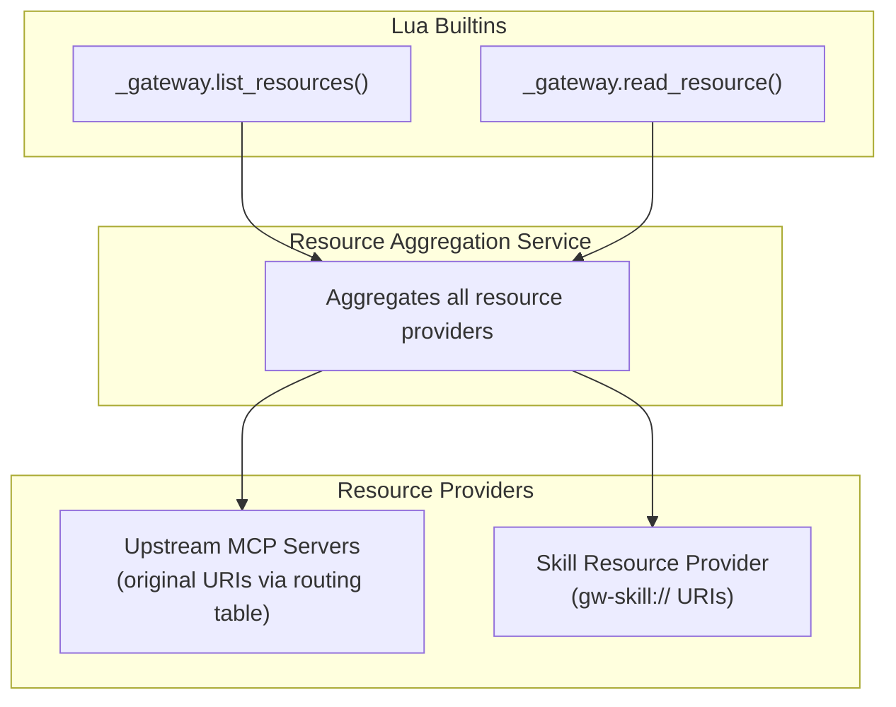

# Skills

Skills are reusable instruction sets that extend the gateway's capabilities for AI agents. They package process documentation, executable scripts, reference materials, and data assets into discoverable MCP resources.

## Why Skills?

AI agents often need structured guidance for complex tasks. Skills solve this by:

- **Reusability** - Write once, use across multiple sessions and agents
- **Discoverability** - Exposed as MCP resources that agents can find and load
- **Composability** - Skills can include scripts, references, and assets
- **Portability** - Skills live in standard directories, easy to share

## Skills as MCP Resources

Skills integrate with the gateway's resource system using a dedicated URI scheme:

```
gw-skill://{skill-name}              → Main SKILL.md content
gw-skill://{skill-name}/{path}       → Nested resources (scripts/, references/, assets/)
```

This is separate from upstream server resource URIs, which pass through **unchanged** (see [Resource Routing](./resource-namespacing.md)). The `gw-skill://` scheme indicates gateway-local skills rather than proxied resources.



## Discovery Workflow

Agents discover and use skills through Lua builtins within `execute` scripts:



## Skill Directory Structure

Skills are stored in the platform-specific config directory:

| Platform | Location                                      |
| -------- | --------------------------------------------- |
| Windows  | `%APPDATA%\my-cool-proxy\skills\`             |
| macOS    | `~/Library/Preferences/my-cool-proxy/skills/` |
| Linux    | `~/.config/my-cool-proxy/skills/`             |

Each skill is a subdirectory containing:

```
skills/
  code-review/
    SKILL.md              # Required - main content with YAML frontmatter
    scripts/              # Optional - executable scripts
      analyze.py
      lint.sh
    references/           # Optional - reference documentation
      CONVENTIONS.md
      API.md
    assets/               # Optional - data files
      config-template.json
      prompts.yaml
```

### SKILL.md Format

The main skill file uses YAML frontmatter followed by markdown content:

```markdown
---
name: code-review
description: Analyze code for quality, maintainability, and test coverage
---

# Code Review Skill

Instructions for the agent on how to perform code reviews...
```

## Lua Builtins for Skills

When skills are enabled, these Lua builtins become available in the `_gateway` global table (within `execute` scripts):

| Builtin                                 | Requires                                          | Description                                            |
| --------------------------------------- | ------------------------------------------------- | ------------------------------------------------------ |
| `_gateway.invoke_skill_script({ ... })` | `skills.enabled: true`                            | Execute a script from a skill's `scripts/` directory   |
| `_gateway.write_skill({ ... })`         | `skills.enabled: true` AND `skills.mutable: true` | Create or modify skills and their files                |
| `_gateway.update_skill({ ... })`        | `skills.enabled: true` AND `skills.mutable: true` | Partially update a skill file using string replacement |

Additionally, these builtins are always available (not skill-specific):

- `_gateway.list_resources()` - List all resources including skills
- `_gateway.read_resource({ uri = "..." })` - Read resources by URI (including `gw-skill://` URIs)
- `_gateway.summary_stats()` - Get gateway statistics

## Configuration

Skills are disabled by default. Enable them in your gateway configuration:

```json
{
  "skills": {
    "enabled": true,
    "mutable": false
  }
}
```

- **`enabled`**: When `true`, skills are exposed as MCP resources
- **`mutable`**: When `true`, agents can create and modify skills

See the [Configuration Guide](../configuration.md#skills) for detailed configuration options.

## Context Injection

Skills are surfaced to AI agents through the `execute` tool description. When agents (or tool search systems) inspect the gateway's tools, the `execute` tool description includes a summary of available skills alongside the server summary. This ensures skill metadata is discoverable without relying on the MCP `instructions` field, which some clients (e.g., Claude Code, Claude Desktop) no longer inject into the agent's context.

### How It Works

When the gateway initializes (or when a new HTTP session connects), the skill discovery service scans the skills directory and builds a manifest of available skills. This manifest is cached by `ServerInfoPreloader` and included in the `execute` tool's description via a dynamic getter.



### What Gets Included

The tool description summary includes:

1. **Skill name** - The identifier for `_gateway.read_resource()` calls
2. **Description** - Tells agents _when_ to load the skill (trigger conditions)

```xml
AVAILABLE SKILLS (load via _gateway.read_resource({ uri = "gw-skill://{name}" }):await()):

<available_skills>
  <skill>
    <name>code-review</name>
    <description>Use when reviewing code for quality...</description>
  </skill>
</available_skills>
```

The description field is critical: it determines when agents choose to load a skill. Poorly-written descriptions lead to skills being ignored or loaded at inappropriate times.

### Session-Scoped Discovery

In HTTP mode, skills are re-discovered for each new session. This enables runtime changes without gateway restarts:

1. Create a new skill with `_gateway.write_skill()`
2. Next session's `execute` tool description includes the new skill
3. Existing sessions see the skill via `_gateway.list_resources()` but not in their tool description

This tradeoff balances discoverability with performance (the cached summary is updated once per session).

## Resources vs Lua Builtins: The Dual Interface

Skills are exposed through both MCP resources (`gw-skill://` URIs) and Lua builtins (`_gateway.list_resources()`, `_gateway.read_resource()`). This is intended to resolve an interoperability problem.

### The Problem: Inconsistent Resource Access

MCP clients handle resources differently; here are some examples:

| Client Behavior         | Example                                                                     |
| ----------------------- | --------------------------------------------------------------------------- |
| **Manual attachment**   | User must explicitly add resources to context before the agent can see them |
| **Built-in discovery**  | Agent has native tools to list and read resources autonomously              |
| **No resource support** | Client only exposes tools, ignoring the resource protocol entirely          |

This inconsistency means skills-as-pure-resources would only work reliably in some environments. An agent using a "manual attachment" client would never discover skills on its own.

### The Solution: Lua Builtin Access

The gateway provides `_gateway.list_resources()` and `_gateway.read_resource()` as **Lua builtins**, accessible within `execute` scripts:



Since all MCP clients support tools, agents can **always** discover and load skills by calling the gateway's `execute` tool with Lua scripts that use the `_gateway` builtins, regardless of how their client handles native resources.

### Complete Skill Interface

| Interface                                | Purpose                                         |
| ---------------------------------------- | ----------------------------------------------- |
| `_gateway.list_resources()` builtin      | Discover available skills (via execute)         |
| `_gateway.read_resource()` builtin       | Load skill content (via execute)                |
| `_gateway.invoke_skill_script()` builtin | Execute bundled scripts (via execute)           |
| `_gateway.write_skill()` builtin         | Create/modify skills when mutable (via execute) |
| Native `resources/list`                  | For clients with built-in resource support      |
| Native `resources/read`                  | For clients with built-in resource support      |

The native resource protocol handlers exist for clients that _do_ support resources well, but the Lua builtins ensure no agent is left behind.

## Implementation Details

### Key Components

| Component                | File                                                    | Purpose                                                                          |
| ------------------------ | ------------------------------------------------------- | -------------------------------------------------------------------------------- |
| `SkillDiscoveryService`  | `apps/gateway/src/services/skill-discovery-service.ts`  | Scans skill directories, reads file stats (mtime, size) in parallel with content |
| `SkillOperationsService` | `apps/gateway/src/services/skill-operations-service.ts` | Creates, modifies, and updates skills                                            |
| `SkillResourceProvider`  | `apps/gateway/src/services/skill-resource-provider.ts`  | Provides skills as MCP resources                                                 |
| `GatewayBuiltinsBuilder` | `apps/gateway/src/tools/gateway-builtins-builder.ts`    | Constructs `_gateway.*` builtins for skill ops                                   |

### MCP Resource Annotations

Each skill resource includes MCP annotations to aid client display and prioritization:

| Field                      | Value                                         | Notes                                                  |
| -------------------------- | --------------------------------------------- | ------------------------------------------------------ |
| `size`                     | Byte size of `SKILL.md`                       | Top-level field; absent for the built-in virtual skill |
| `annotations.audience`     | `["assistant"]`                               | Signals the resource is intended for the AI assistant  |
| `annotations.priority`     | `0.5`                                         | Display ranking hint for MCP clients                   |
| `annotations.lastModified` | ISO 8601 timestamp from `SKILL.md` file mtime | Absent for the built-in virtual skill                  |

### Resource Integration

Skills integrate with the resource aggregation system:



## Built-in Skills

The gateway includes a built-in skill:

- **`writing-gateway-skills`** - Instructions for creating new skills, available when `skills.mutable: true`

## Security Considerations

- Scripts execute in the gateway's process context
- Use `mutable: false` in production to prevent unauthorized skill modifications
- Review skill scripts before deploying to shared environments
