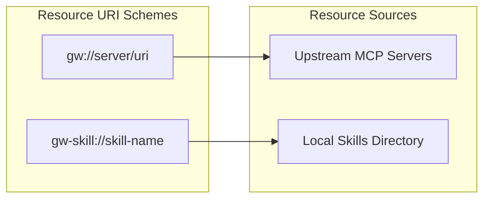
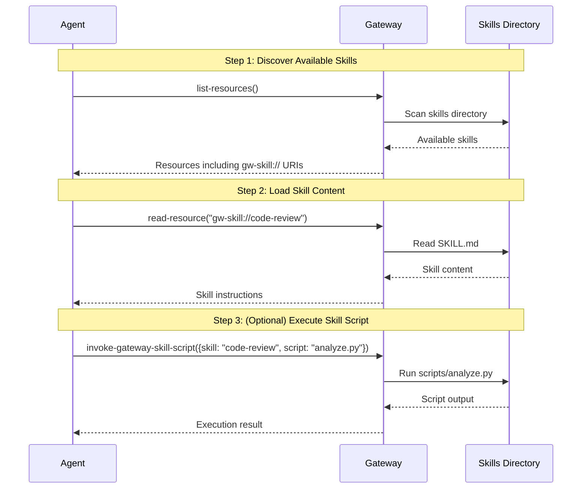
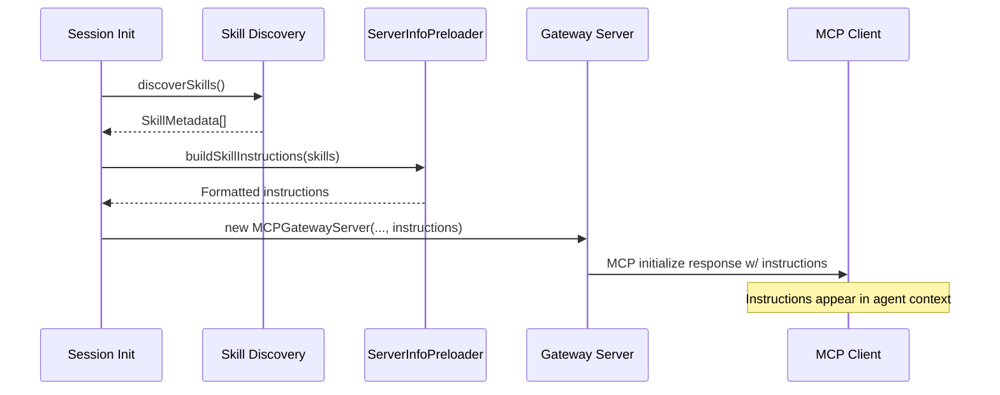
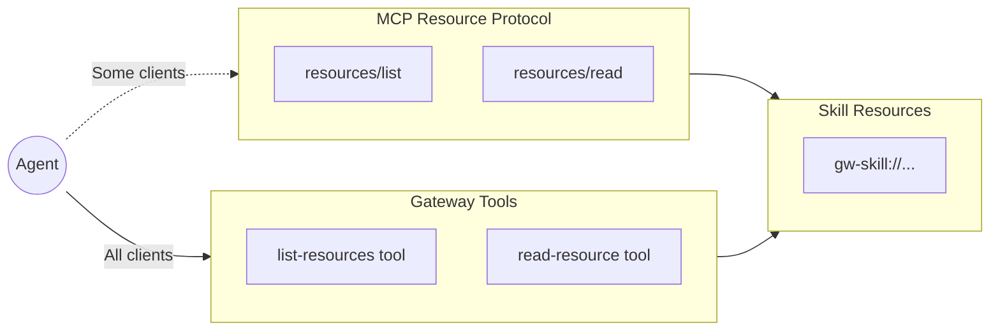
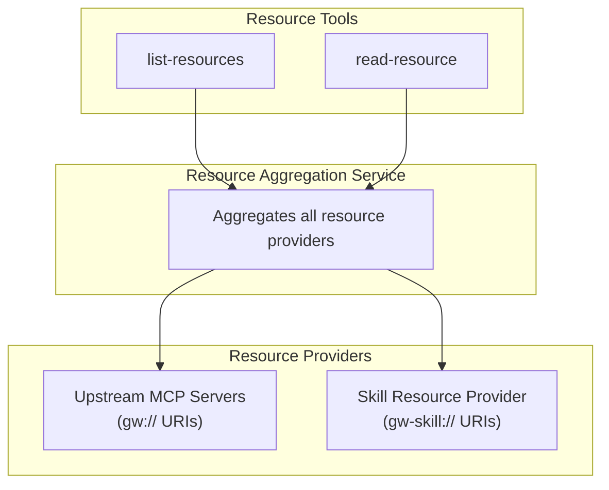

# Skills

Skills are reusable instruction sets that extend the gateway's capabilities for AI agents. They package process documentation, executable scripts, reference materials, and data assets into discoverable MCP resources.

## Why Skills?

AI agents often need structured guidance for complex tasks. Skills solve this by:

- **Reusability** - Write once, use across multiple sessions and agents
- **Discoverability** - Exposed as MCP resources that agents can find and load
- **Composability** - Skills can include scripts, references, and assets
- **Portability** - Skills live in standard directories, easy to share

## Skills as MCP Resources

Skills integrate with the gateway's resource system using a dedicated URI scheme:

```
gw-skill://{skill-name}              → Main SKILL.md content
gw-skill://{skill-name}/{path}       → Nested resources (scripts/, references/, assets/)
```

This is separate from the `gw://` scheme used for upstream server resources. The `gw-skill://` scheme indicates gateway-local skills rather than proxied resources.



## Discovery Workflow

Agents discover and use skills through standard MCP resource operations:



## Skill Directory Structure

Skills are stored in the platform-specific config directory:

| Platform | Location                                      |
| -------- | --------------------------------------------- |
| Windows  | `%APPDATA%\my-cool-proxy\skills\`             |
| macOS    | `~/Library/Preferences/my-cool-proxy/skills/` |
| Linux    | `~/.config/my-cool-proxy/skills/`             |

Each skill is a subdirectory containing:

```
skills/
  code-review/
    SKILL.md              # Required - main content with YAML frontmatter
    scripts/              # Optional - executable scripts
      analyze.py
      lint.sh
    references/           # Optional - reference documentation
      CONVENTIONS.md
      API.md
    assets/               # Optional - data files
      config-template.json
      prompts.yaml
```

### SKILL.md Format

The main skill file uses YAML frontmatter followed by markdown content:

```markdown
---
name: code-review
description: Analyze code for quality, maintainability, and test coverage
---

# Code Review Skill

Instructions for the agent on how to perform code reviews...
```

## Gateway Tools for Skills

When skills are enabled, these tools become available:

| Tool                          | Requires                                          | Description                                          |
| ----------------------------- | ------------------------------------------------- | ---------------------------------------------------- |
| `invoke-gateway-skill-script` | `skills.enabled: true`                            | Execute a script from a skill's `scripts/` directory |
| `write-gateway-skill`         | `skills.enabled: true` AND `skills.mutable: true` | Create or modify skills                              |

## Configuration

Skills are disabled by default. Enable them in your gateway configuration:

```json
{
  "skills": {
    "enabled": true,
    "mutable": false
  }
}
```

- **`enabled`**: When `true`, skills are exposed as MCP resources
- **`mutable`**: When `true`, agents can create and modify skills

See the [Configuration Guide](../configuration.md#skills) for detailed configuration options.

## Context Injection

Skills are surfaced to AI agents through MCP server instructions, which appear in the system prompt before every conversation turn. This provides agents with metadata about available skills without requiring explicit tool calls.

### How It Works

When the gateway initializes (or when a new HTTP session connects), the skill discovery service scans the skills directory and builds a manifest of available skills. This manifest is injected into the gateway's MCP `instructions` field, which MCP clients automatically surface in the agent's context.



### What Gets Injected

The injected instructions include:

1. **Skill name** - The identifier for `read-resource` calls
2. **Description** - Tells agents _when_ to load the skill (trigger conditions)
3. **Usage hints** - How to access skill content and nested resources

```xml
<available_skills>
  <skill>
    <name>code-review</name>
    <description>Use when reviewing code for quality...</description>
  </skill>
</available_skills>
```

The description field is critical: it determines when agents choose to load a skill. Poorly-written descriptions lead to skills being ignored or loaded at inappropriate times.

### Session-Scoped Discovery

In HTTP mode, skills are re-discovered for each new session. This enables runtime changes without gateway restarts:

1. Create a new skill with `write-gateway-skill`
2. Next session sees the new skill in its instructions
3. Existing sessions see the skill via `list-resources` but not in their original instructions

This tradeoff balances discoverability with performance (instruction injection happens once per session).

## Resources vs Tools: The Dual Interface

Skills are exposed through both MCP resources (`gw-skill://` URIs) and gateway tools (`list-resources`, `read-resource`). This is intended to resolve an interoperability problem.

### The Problem: Inconsistent Resource Access

MCP clients handle resources differently; here are some examples:

| Client Behavior         | Example                                                                     |
| ----------------------- | --------------------------------------------------------------------------- |
| **Manual attachment**   | User must explicitly add resources to context before the agent can see them |
| **Built-in discovery**  | Agent has native tools to list and read resources autonomously              |
| **No resource support** | Client only exposes tools, ignoring the resource protocol entirely          |

This inconsistency means skills-as-pure-resources would only work reliably in some environments. An agent using a "manual attachment" client would never discover skills on its own.

### The Solution: Tool-Based Access

The gateway exposes `list-resources` and `read-resource` as **tools**, not just as MCP resource protocol handlers:



Since all MCP clients support tools, agents can **always** discover and load skills by calling the gateway's tools, regardless of how their client handles native resources.

### Complete Skill Interface

| Interface                          | Purpose                                      |
| ---------------------------------- | -------------------------------------------- |
| `list-resources` tool              | Discover available skills (works everywhere) |
| `read-resource` tool               | Load skill content (works everywhere)        |
| `invoke-gateway-skill-script` tool | Execute bundled scripts                      |
| `write-gateway-skill` tool         | Create/modify skills (when mutable)          |
| Native `resources/list`            | For clients with built-in resource support   |
| Native `resources/read`            | For clients with built-in resource support   |

The native resource protocol handlers exist for clients that _do_ support resources well, but the tools ensure no agent is left behind.

## Implementation Details

### Key Components

| Component                      | File                                            | Purpose                                         |
| ------------------------------ | ----------------------------------------------- | ----------------------------------------------- |
| `SkillDiscoveryService`        | `src/services/skill-discovery-service.ts`       | Scans skill directories, resolves skill content |
| `SkillResourceProvider`        | `src/services/skill-resource-provider.ts`       | Provides skills as MCP resources                |
| `InvokeGatewaySkillScriptTool` | `src/tools/invoke-gateway-skill-script-tool.ts` | Executes skill scripts                          |
| `WriteGatewaySkillTool`        | `src/tools/write-gateway-skill-tool.ts`         | Creates/modifies skills                         |

### Resource Integration

Skills integrate with the resource aggregation system:



## Built-in Skills

The gateway includes a built-in skill:

- **`writing-gateway-skills`** - Instructions for creating new skills, available when `skills.mutable: true`

## Security Considerations

- Scripts execute in the gateway's process context
- Use `mutable: false` in production to prevent unauthorized skill modifications
- Review skill scripts before deploying to shared environments
