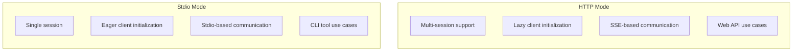
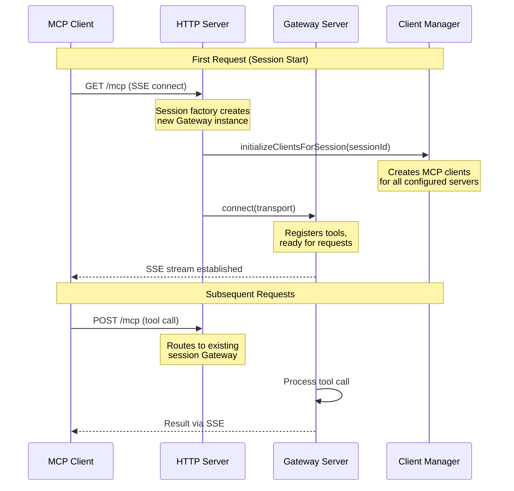
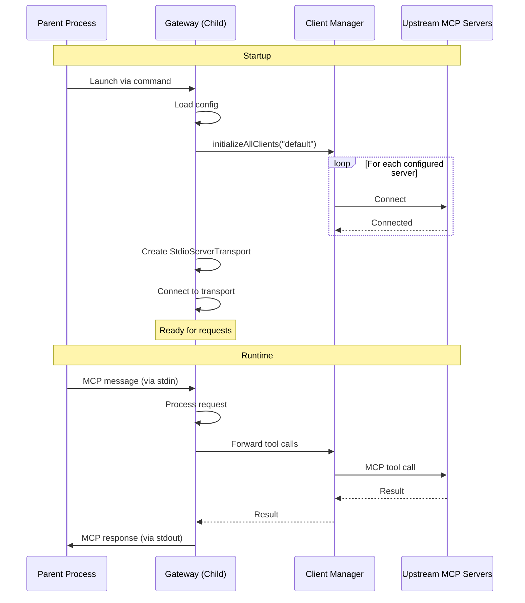

# Transport Modes

The MCP Gateway Proxy supports two transport modes: **HTTP** and **stdio**. This document explains how each mode works and when to use them.

## Overview



## HTTP Mode (Default)

HTTP mode runs the gateway as an HTTP server, supporting multiple concurrent sessions.

### How It Works



### Key Characteristics

| Aspect          | Description                                                                 |
| --------------- | --------------------------------------------------------------------------- |
| **Sessions**    | Each client gets an isolated session identified by `mcp-session-id` header  |
| **Client Init** | MCP clients created lazily when a session first makes a request             |
| **Transport**   | Streamable HTTP transport via `@karashiiro/mcp` abstraction                 |
| **Endpoint**    | Single `/mcp` endpoint handles GET (SSE), POST (messages), DELETE (cleanup) |

### Session ID Handling

1. Client sends `mcp-session-id` header with requests
2. If no header provided, a pending ID is generated: `pending-${timestamp}-${random}`
3. Session IDs are propagated to upstream MCP servers (unless pending or "default")
4. Each session gets its own Gateway server instance via the session factory

### Configuration

```json
{
  "transport": "http",
  "port": 8080,
  "host": "localhost"
}
```

Environment overrides:

- `PORT` - Override the port
- `HOST` - Override the host

### When to Use HTTP Mode

- Web APIs serving multiple concurrent agents
- Cloud deployments
- Multi-tenant scenarios
- When you need session isolation

## Stdio Mode

Stdio mode runs the gateway as a stdio-based MCP server, typically launched by a client process.

### How It Works



### Key Characteristics

| Aspect            | Description                                    |
| ----------------- | ---------------------------------------------- |
| **Sessions**      | Single session with fixed ID "default"         |
| **Client Init**   | All MCP clients initialized eagerly at startup |
| **Transport**     | Uses `StdioServerTransport` from MCP SDK       |
| **Communication** | JSON-RPC over stdin/stdout                     |

### Configuration

```json
{
  "transport": "stdio"
}
```

Port and host settings are ignored in stdio mode.

### Important Limitations

- **Cannot use `pnpm dev`** - The development server uses stdout for logs, which conflicts with the MCP protocol
- **Must build first** - Run `pnpm build && node dist/index.js`
- **Single session only** - No concurrent clients supported

### When to Use Stdio Mode

- CLI tools that launch the gateway as a subprocess
- Single-agent scenarios
- Local development with Claude Desktop or similar clients
- When you don't need HTTP infrastructure

## Comparison

| Feature               | HTTP Mode   | Stdio Mode    |
| --------------------- | ----------- | ------------- |
| Multiple sessions     | Yes         | No            |
| Client initialization | Lazy        | Eager         |
| Session ID            | From header | "default"     |
| Development server    | Works       | Not supported |
| Typical use case      | Web APIs    | CLI tools     |
| Transport             | SSE/HTTP    | stdin/stdout  |

## Implementation Details

### Entry Point (`src/index.ts`)

The entry point reads the transport configuration and starts the appropriate mode using the `@karashiiro/mcp` abstraction layer:

- **HTTP mode**: Uses `serveHttp()` with a session factory that creates isolated Gateway instances per session
- **Stdio mode**: Uses `serveStdio()` with a single Gateway instance

Session management in HTTP mode is handled via callbacks:

- `sessionFactory`: Creates a new `MCPGatewayServer` for each session
- `onSessionInitialized`: Initializes MCP clients for the new session
- `onSessionClosed`: Cleans up session resources

## Related Documentation

- [Session Management](./session-management.md) - How sessions and clients are managed
- [Index](./index.md) - High-level architecture overview
