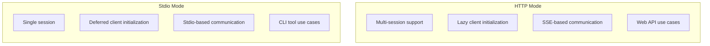
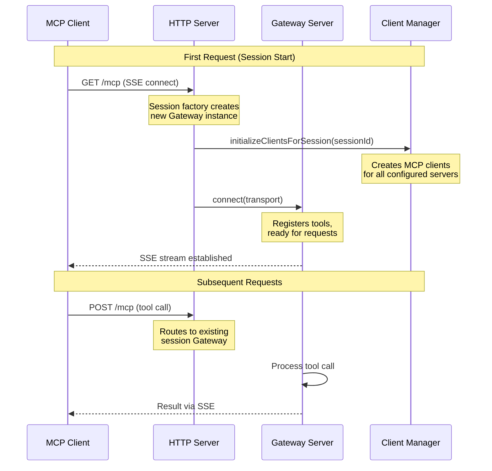
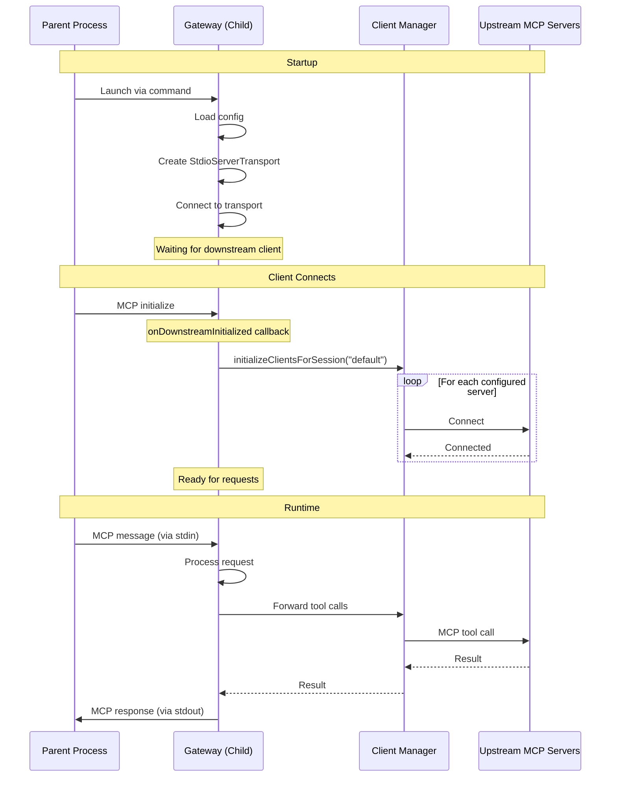

# Transport Modes

The MCP Gateway Proxy supports two transport modes: **HTTP** and **stdio**. This document explains how each mode works and when to use them.

## Overview


```mermaid
flowchart TB
    subgraph HTTP["HTTP Mode"]
        direction TB
        H1["Multi-session support"]
        H2["Lazy client initialization"]
        H3["SSE-based communication"]
        H4["Web API use cases"]
    end

    subgraph Stdio["Stdio Mode"]
        direction TB
        S1["Single session"]
        S2["Deferred client initialization"]
        S3["Stdio-based communication"]
        S4["CLI tool use cases"]
    end
```

## HTTP Mode (Default)

HTTP mode runs the gateway as an HTTP server, supporting multiple concurrent sessions.

### How It Works


```mermaid
sequenceDiagram
    participant Client as MCP Client
    participant HTTP as HTTP Server
    participant Gateway as Gateway Server
    participant Clients as Client Manager

    Note over Client,Clients: First Request (Session Start)
    Client->>HTTP: GET /mcp (SSE connect)
    Note over HTTP: Session factory creates<br/>new Gateway instance
    HTTP->>Clients: initializeClientsForSession(sessionId)
    Note over Clients: Creates MCP clients<br/>for all configured servers
    HTTP->>Gateway: connect(transport)
    Note over Gateway: Registers tools,<br/>ready for requests
    Gateway-->>Client: SSE stream established

    Note over Client,Clients: Subsequent Requests
    Client->>HTTP: POST /mcp (tool call)
    Note over HTTP: Routes to existing<br/>session Gateway
    Gateway->>Gateway: Process tool call
    Gateway-->>Client: Result via SSE
```

### Key Characteristics

| Aspect          | Description                                                                 |
| --------------- | --------------------------------------------------------------------------- |
| **Sessions**    | Each client gets an isolated session identified by `mcp-session-id` header  |
| **Client Init** | MCP clients created lazily when a session first makes a request             |
| **Transport**   | Streamable HTTP transport via `@karashiiro/mcp` abstraction                 |
| **Endpoint**    | Single `/mcp` endpoint handles GET (SSE), POST (messages), DELETE (cleanup) |
| **Persistence** | Session state persisted to SQLite; survives server restarts                 |
| **Session TTL** | Sessions expire after 5 minutes of inactivity                               |

See [Session Management - Session Persistence](./session-management.md#session-persistence-http-mode) for details on SQLite persistence.

### Session ID Handling

1. Client sends `mcp-session-id` header with requests
2. If no header provided, a pending ID is generated: `pending-${timestamp}-${random}`
3. Each session's upstream connections get their own independent session IDs
4. Each session gets its own Gateway server instance via the session factory

### Configuration

```json
{
  "transport": "http",
  "port": 8080,
  "host": "localhost"
}
```

Environment overrides:

- `PORT` - Override the port
- `HOST` - Override the host

### Client Roots

When the downstream client advertises the `roots` capability, the gateway queries `roots/list` (with a 5-second timeout) before spawning stdio upstream servers. The first valid local filesystem path is used as the `cwd` for those processes, allowing tools like Playwright to operate in the client's project directory.

### Graceful Shutdown

On SIGINT/SIGTERM, HTTP mode:

1. Sets a shutdown flag to immediately reject new sessions
2. Enforces a 5-second timeout on draining existing connections
3. Force-closes connections that don't drain in time

### When to Use HTTP Mode

- Web APIs serving multiple concurrent agents
- Cloud deployments
- Multi-tenant scenarios
- When you need session isolation

## Stdio Mode

Stdio mode runs the gateway as a stdio-based MCP server, typically launched by a client process.

### How It Works


```mermaid
sequenceDiagram
    participant Parent as Parent Process
    participant Gateway as Gateway (Child)
    participant Clients as Client Manager
    participant Upstream as Upstream MCP Servers

    Note over Parent,Upstream: Startup
    Parent->>Gateway: Launch via command
    Gateway->>Gateway: Load config
    Gateway->>Gateway: Create StdioServerTransport
    Gateway->>Gateway: Connect to transport
    Note over Gateway: Waiting for downstream client

    Note over Parent,Upstream: Client Connects
    Parent->>Gateway: MCP initialize
    Note over Gateway: onDownstreamInitialized callback
    Gateway->>Clients: initializeClientsForSession("default")
    loop For each configured server
        Clients->>Upstream: Connect
        Upstream-->>Clients: Connected
    end
    Note over Gateway: Ready for requests

    Note over Parent,Upstream: Runtime
    Parent->>Gateway: MCP message (via stdin)
    Gateway->>Gateway: Process request
    Gateway->>Clients: Forward tool calls
    Clients->>Upstream: MCP tool call
    Upstream-->>Clients: Result
    Clients-->>Gateway: Result
    Gateway->>Parent: MCP response (via stdout)
```

### Key Characteristics

| Aspect            | Description                                                               |
| ----------------- | ------------------------------------------------------------------------- |
| **Sessions**      | Single session with fixed ID "default"                                    |
| **Client Init**   | MCP clients initialized when downstream client completes initialize handshake |
| **Transport**     | Uses `StdioServerTransport` from MCP SDK                                  |
| **Communication** | JSON-RPC over stdin/stdout                                                |

### Configuration

```json
{
  "transport": "stdio"
}
```

Port and host settings are ignored in stdio mode.

### Important Limitations

- **Cannot use `pnpm dev`** - The development server uses stdout for logs, which conflicts with the MCP protocol
- **Must build first** - Run `pnpm build && node dist/index.js`
- **Single session only** - No concurrent clients supported

### Client Roots

Same as HTTP mode: when the downstream client advertises `roots`, the gateway queries `roots/list` (with a 5-second timeout) and uses the first valid local path as `cwd` for stdio upstream servers.

### When to Use Stdio Mode

- CLI tools that launch the gateway as a subprocess
- Single-agent scenarios
- Local development with Claude Desktop or similar clients
- When you don't need HTTP infrastructure

## Comparison

| Feature               | HTTP Mode   | Stdio Mode    |
| --------------------- | ----------- | ------------- |
| Multiple sessions     | Yes         | No            |
| Client initialization | Lazy        | Deferred      |
| Session ID            | From header | "default"     |
| Development server    | Works       | Not supported |
| Typical use case      | Web APIs    | CLI tools     |
| Transport             | SSE/HTTP    | stdin/stdout  |

## Implementation Details

### Entry Point (`apps/gateway/src/index.ts`)

The entry point reads the transport configuration and starts the appropriate mode using the `@karashiiro/mcp` abstraction layer:

- **HTTP mode**: Uses `serveHttp()` (from `@karashiiro/mcp/http`) with a session factory that creates isolated Gateway instances per session
- **Stdio mode**: Uses `serveStdio()` (from `@karashiiro/mcp/stdio`) with a single Gateway instance

Session management in HTTP mode is handled via callbacks:

- `sessionFactory`: Creates a new `MCPGatewayServer` for each session
- `onSessionInitialized`: Initializes MCP clients for the new session
- `onSessionClosed`: Cleans up session resources

## Related Documentation

- [Session Management](./session-management.md) - How sessions and clients are managed
- [Index](./index.md) - High-level architecture overview
